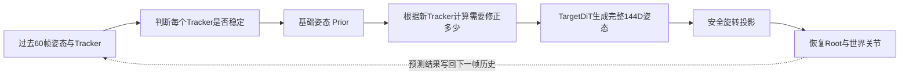

# DiffusionPoser TAID 重构与实验进展说明

> 更新时间：2026-08-08  
> 用途：用于项目组内同步“我们为什么改、改了什么、实验说明了什么、现在走到哪里、下一步怎么做”。  
> 当前结论先说在前面：代码主链路已经完成较系统的重构和验证，但研究效果仍处于 B1 基础先验阶段。Tracker-history 版本已经完成5k训练与曲线评估，输入链路是正确的，但15帧误差反而恶化约8%，说明问题不只是“有没有历史”。固定六槽版本已经通过真实 K15 batch 预检，当前正在从同一个正式 B0 独立训练5k对照；六个 Tracker 被过早平均是否真是主要原因，仍要等29AF的固定曲线才能判断。

## 一、项目要解决的实际问题

这个项目要做的是：在 VR 或实时数字人场景中，仅依靠头、双手，以及可选的腰部和双脚 Tracker，连续还原完整人体动作。

理想情况下，系统不仅要支持稳定的三点和六点输入，还要面对更真实的情况：设备可能临时掉线，也可能在运行中重新连接。人物不能因为少了一个 Tracker 就突然转身、跳变或持续漂移；Tracker 恢复后，也不能瞬间把整个人“拽”到另一个姿态。

原来的 TargetDiT + DDIM 主干已经能根据稀疏 Tracker 生成完整姿态，但它把不同状态的 Tracker 看得比较相似：长期稳定的 Tracker、刚刚恢复的 Tracker、暂时丢失的 Tracker，没有非常明确的分工。因此我们引入了 TAID 方案，核心想法可以用一句话概括：

> 先用稳定信息估计一个完整、连续的基础姿态，再让刚恢复或不稳定的 Tracker 只负责逐步修正这个基础姿态。

为了避免一次改动太多导致无法判断提升来自哪里，我们始终保持以下稳定边界不变：

- 输入 Tracker 仍是 13 维，没有为了迁就旧文档改成 15 维；
- 输出仍是 24 个关节、共 144 维的完整姿态；
- TargetDiT、Diffusion、DDIM 主流程保持不变；
- 保留现有的安全旋转投影；
- 不修改 Unity 已经稳定使用的输入输出接口；
- 每轮实验只改变一个主要因素，失败的 checkpoint 不拿来继续训练下一轮。

当前整体流程可以理解为：



这里的 “Prior” 可以简单理解为“在看当前不稳定信息之前，系统先猜出的基础全身姿态”；FK 则是“根据关节旋转算出关节实际位置”的过程。

## 二、为什么没有一开始就直接训练新模型

最初审计时发现了两个基础契约问题。如果不先修复，后续实验即使得到更低的 loss，也可能是在学习错误的目标。

### 1. Root yaw 的含义混在了一起

代码中曾同时存在两种“人物朝向”：

- source 里为了拆分动作使用的 Actor Root yaw；
- 144D 姿态中 Pelvis 真正朝向的 heading。

两者在部分动作里可以稳定相差接近 180°。过去如果直接拿它们比较，就会把表示方式的差异当成模型预测错误。

我们统一了训练目标、runtime 和评估口径：最终人物朝向只从 144D 姿态中的 Pelvis 朝向解码，并统一限制到 `[-π, π)`。修复后的自洽误差约为 `2.38e-7 rad`，说明同一条数据在生成、解码和评估之间已经一致。

### 2. Tracker 文档写15维，但稳定实现是13维

TAID 初始方案中把 Tracker 写成了15维，额外两维想直接存速度或变化量；当前 Python 与 Unity 稳定接口实际都是13维：

```text
位置3 + 旋转6 + 是否配置 + 当前是否有效 + 掉线时长 + 连续恢复时长
```

我们没有为了对齐方案文档而修改稳定接口，而是从过去60帧 Tracker 历史中内部计算速度和变化趋势。这样既能实现 TAID 的想法，也不会破坏现有数据、模型和 Unity 对接。

这两项修复完成后，才建立了可用于比较的正式 B0 基线。

## 三、正式 B0 告诉了我们什么

正式 B0 使用现有 TargetDiT + 安全 Projected DDIM，训练到120k步。评估固定使用：

- seed 和 timeline seed 均为10；
- EMA 权重；
- 5步 DDIM；
- 每一步都执行安全投影；
- 固定的18条长序列。

主要结果如下：

| 条件 | MPJPE | Root yaw表现 | 结论 |
|---|---:|---|---|
| 稳定六点 | `3.41 cm` | 平均约 `0.38°` | 基线在完整观测下工作正常 |
| 稳定三点 | `19.64 cm` | 平均约 `101.93°` | 缺少腰和脚后明显失稳 |

进一步查看三点模式，而不是只看平均值后，问题更加明确：

- steady-state Root yaw 中位数为 `161.13°`；
- `55.32%` 的帧误差超过 `150°`；
- 18条序列中有9条，大多数帧都处于相反朝向。

这说明两件事：

第一，旧的评估语义问题已经修复；第二，修复后仍然存在一个真实的模型问题——三点输入下，模型容易把身体正面和背面判断反。这不是简单把运行时结果旋转180°就能可靠解决的问题，因为那会把模型不确定性隐藏起来，而且容易破坏正常序列。

因此我们决定在模型内部解决，而不是加入“误差接近180°就翻转”的补丁。

## 四、TAID Phase 1～4 做了哪些代码建设

在不改变主干和稳定接口的前提下，我们把 TAID 拆成了可以单独验证的阶段。

### Phase 1：让系统先分清 Tracker 的状态

每个 Tracker 现在被明确区分为：

- 未配置：设备本来就不存在；
- Missing：设备已配置，但当前没有测量；
- Uncertain：刚恢复，还不能立刻完全信任；
- Anchor：已经连续稳定一段时间，可以作为可靠锚点。

Head 始终是 Anchor。其他 Tracker 恢复后，可信度会在第5帧到第15帧之间平滑增加，不会在第15帧突然切换一条完全不同的模型路径。

这部分已经有 NumPy 与 PyTorch 两套一致性测试，边界、掉线和重连行为均已锁定。

### Phase 2：增加轻量基础姿态 Prior

Prior 根据过去姿态、稳定 Tracker、头部轨迹和覆盖区域，先给出：

- 当前完整144D姿态；
- 人物 Root 的内部位置状态；
- 左右脚接触概率；
- 训练期使用的关节速度辅助结果。

B1 阶段只训练这部分，原 TargetDiT 主干保持冻结，便于单独判断 Prior 是否真的有能力稳定身体。

Root yaw 也在这一阶段改成“单一真值”：不再单独预测另一份 yaw，而是直接从最终144D姿态中的 Pelvis 朝向得到。这样训练优化的朝向和部署实际使用的朝向是同一个量。

### Phase 3：增加基于 FK 的修正信息

当某个 Tracker 刚恢复时，系统先用 Prior 预测它对应关节应该在哪里，再比较实际 Tracker 在哪里。两者的差值就是需要修正的方向和大小。

这种做法比直接把刚恢复的 Tracker 当成绝对真值更平滑，也更容易解释。例如左脚恢复后，主要应该修正左腿，人物躯干可以有限调整，但不应让右手突然跳动。

### Phase 4：固定区域路由和连续恢复

目前采用可审计的固定作用范围：

- Hip 主要影响躯干和 Root，次要影响双腿；
- 手主要影响对应手臂，轻微影响躯干；
- 脚主要影响对应腿，接触地面时可以轻微影响 Root；
- Head 不走重连修正分支。

路由只限制“新信息从哪里直接进入”，不会切断 TargetDiT 原有的全身关联能力。

截至目前，Phase 1～4 的结构、前向、反向、checkpoint 阶段检查、单序列和批量 runtime 都已经实现并通过测试。但需要特别强调：

> B2～B6 目前只有“代码已实现、测试可运行”的证据，还没有正式训练和长序列效果证据。当前研究流程仍在先把 B1 基础 Prior 做可靠。

## 五、第一轮 B1 为什么没有直接成功

### 1. Root yaw 单一真值 pilot

第一轮5k pilot 中，三点模式 `>150°` 的比例降到了 `13.23%`，π 模态多数序列也降为0。这说明“让 yaw 直接来自最终姿态”确实改善了相反朝向问题。

但是 deployed MPJPE 达到了 `49.28 cm`。也就是说，人物可能朝向没有完全反，但整体关节位置依然很差，因此不能只凭 yaw 指标宣布成功。

### 2. 冷启动增强并没有解决问题

我们曾假设：系统刚启动时没有足够历史，早期的小方向错误被不断写回历史，最终锁定成相反朝向。因此设计了 B1-CS，让训练更频繁地看到零历史、短历史和三点输入。

结果恰好证明这条路不能单独解决问题：

- `0～14` 帧的 `>150°` 比例为 `66.67%`；
- `15～29` 帧为 `66.67%`；
- `30～59` 帧仍为 `61.11%`。

这轮实验被明确淘汰。结论不是“冷启动不重要”，而是“只增加冷启动样本，无法弥补模型内部尚未对齐的问题”。

## 六、发现并修复训练与部署不一致

随后我们发现一个更关键的问题：训练阶段计算 FK 误差时，使用了 Prior 内部预测的 Root 位置；部署阶段却没有使用这个位置，而是由 Head 和地面重新解析人物 Root。

这相当于训练时拿一把尺子打分，真正运行时换了另一把尺子。训练日志里的 FK loss 可以很低，但部署后的关节仍然很差。

当时六点前三条长序列已经给出了非常强的矛盾证据：

- 训练内部 `prior_fk_loss` 约为 `0.012 m`；
- 实际 deployed MPJPE 却达到 `42.75 cm`；
- 非 Head Tracker 位置误差达到 `0.684 m`；
- 安全投影后的硬旋转误差仍只有约 `1.38e-6°`。

因此我们把 B1 的主要 FK 监督改成与 runtime 完全相同的路径：

```text
最终144D姿态
→ 安全旋转投影
→ 与runtime相同的Head/地面解析
→ 世界关节
→ 与GT关节比较
```

Prior 内部 Root/FK 仍然保留，但只作为诊断，不再替代部署路径的主 loss。同时新增了内部 Root 与部署 Root 的差距、内部关节与部署关节的差距，便于以后快速发现“两套真值”。

这次修复守住了两个边界：最终部署 Root 仍由现有 Resolver 决定，Unity 接口不变；Prior Root 只作为 TAID 内部辅助信息。

## 七、为什么又做了 Teacher-Forced 与多 Horizon 诊断

Root/FK 契约修复后，新的5k pilot 在长序列上仍然很差：

| 条件 | steady MPJPE | 其他现象 |
|---|---:|---|
| 三点 | `43.656 cm` | π比例有所改善，但几何失效 |
| 六点 | `41.750 cm` | 硬旋转仍精确，整体姿态却漂移 |

此时有两种可能：

1. 模型连“给定正确历史后的下一帧”都预测不好；
2. 模型单步预测很好，但把自己的预测不断写回历史后，误差逐渐累积。

为区分两者，我们新增了两种只读诊断：

- Teacher-forced：每一帧都给模型正确的过去60帧，只看单步能力；
- Closed-loop：先给正确历史，然后连续使用模型自己的预测，观察第1、4、15、30、60帧误差。

结果非常明确：

| 条件 | 正确历史单步 | h1 | h4 | h15 | h30 | h60 |
|---|---:|---:|---:|---:|---:|---:|
| 三点 | `0.692 cm` | `0.677` | `2.586` | `8.602` | `14.985` | `21.912` |
| 六点 | `0.612 cm` | `0.608` | `2.314` | `7.536` | `13.054` | `18.960` |

Teacher-forced 与 closed-loop 的第一帧完全一致，说明诊断本身没有状态重置错误。模型在正确历史下单步表现很好，但使用自身历史后迅速恶化，因此主要问题被确认是：

> 预测的小误差进入下一帧历史后被继续放大，模型训练时接触这种连续错误历史的程度还不够。

这也是我们后来把训练 rollout 从最多4帧扩展到15帧的原因。

## 八、15帧闭环训练做了什么，得到什么

### 1. 数据和训练链路扩展

我们没有重建 AMASS，也没有重算正式 normalizer，而是：

- 基于现有 source 生成1024规模的小型 K15 task，最终得到1018个可用 source/task；
- 每条训练样本最多包含15个连续预测目标和75帧连续 Tracker 状态；
- 模型每一步仍只读取60帧历史、预测一个144D姿态，Transformer窗口没有变长；
- 第一步预测写入历史后再预测下一步，最多连续15次；
- 复用正式 normalizer 的六个统计文件，并逐字节核对一致性；
- 真实15帧反向预检选择 batch=4，显存满足要求。

### 2. R4-Control 与 R15 公平对照

两组实验使用完全相同的数据、B0、seed、batch、loss和场景，唯一差别是训练连续预测4帧还是15帧。

结果如下：

| 条件 | 实验 | h1 | h15 | mean(h30,h60) |
|---|---|---:|---:|---:|
| 三点 | R4-Control | `1.011` | `11.293` | `27.244` |
| 三点 | R15 | `0.880` | `10.079` | `19.334` |
| 六点 | R4-Control | `0.905` | `9.887` | `23.375` |
| 六点 | R15 | `0.820` | `9.227` | `17.681` |

R15 对30～60帧的长期漂移改善明显，三点和六点分别改善约 `29.04%` 和 `24.36%`。但 h15 只改善 `10.75%` 和 `6.67%`，没有达到预先设定的25%门槛。

因此结论是：15帧闭环训练方向是有效的，但现有监督分配不足以把15帧内误差压下来。

### 3. 提高闭环样本比例：R15-P100

下一轮只把“执行闭环训练的概率”从50%提高到100%，其他条件不变。

结果继续改善长时间漂移，但 h15 仍未通过：

| 条件 | h1 | h15 | mean(h30,h60) |
|---|---:|---:|---:|
| 三点 | `0.973` | `10.060` | `18.554` |
| 六点 | `0.848` | `8.594` | `15.577` |

这说明“让更多 batch 做闭环”有帮助，但不是15帧误差的主要限制。

### 4. 加重后段监督：R15-LW

接着只改变15帧内部的权重：越接近第15帧，监督越强；总权重仍保持不变。

结果为：

| 条件 | 正确历史单步 | h1 | h15 | mean(h30,h60) |
|---|---:|---:|---:|---:|
| 三点 | `0.880` | `0.898` | `9.719` | `19.127` |
| 六点 | `0.779` | `0.796` | `8.634` | `16.868` |

基础能力、第一帧和长期漂移都正常，但 h15 仍高于门槛：三点要求不超过 `8.470 cm`，六点要求不超过 `7.415 cm`。

到这里可以比较有把握地说：

> 继续调整闭环出现概率或15帧内部权重，收益已经有限；下一步应该检查 Prior 实际使用了哪些输入，而不是继续调训练比例。

## 九、Prior 能力审计发现了新的结构缺口

我们使用 R15-LW checkpoint 做了只读审计，没有继续训练，也没有重新采样长序列。

### 1. 最关键的发现

现有 Observation Encoder 已经为每个 Tracker 总结了过去60帧的变化趋势，但 B1 Prior 并没有使用这份信息。

审计中我们分别交换不同输入，观察 Prior 输出变化：

- 交换过去姿态后，Prior 姿态最大变化为 `1.11337`，部署关节平均变化 `0.25763 m`；
- 交换整个过去60帧 Tracker 历史后，姿态、关节、Root、接触和速度变化全部严格为0；
- 当前 Tracker 和当前头部轨迹都能影响 Prior；
- 可信度为0的 Tracker 历史不会泄漏进 Prior。

换句话说，旧 Prior 主要依赖“自己过去预测了什么”，却没有独立读取“Tracker 过去60帧实际怎么运动”。一旦预测姿态历史被误差污染，Prior 缺少另一条稳定的时序信号帮助纠正。

### 2. 不是速度 loss 没有梯度

我们也分开检查了各项 loss 的梯度流向。结果表明：

- 速度辅助监督确实能更新速度分支和共享特征；
- 它不会直接更新姿态输出层，这是当前结构本来的定义；
- rollout 的关节速度和旋转速度监督能够更新姿态输出层；
- B1 仍然只有 Prior 参数参与训练；
- Observation Encoder 保持冻结。

因此本轮没有同时修改速度监督，避免把两个变量混在一起。

### 3. 哪些身体区域最容易累积错误

在 h15 时，五个区域的平均 MPJPE 大致为：

| 条件 | 躯干 | 左臂 | 右臂 | 左腿 | 右腿 |
|---|---:|---:|---:|---:|---:|
| 三点 | `4.03` | `10.15` | `11.93` | `15.84` | `15.41` |
| 六点 | `3.81` | `10.11` | `11.90` | `13.15` | `12.60` |

前一帧误差与当前帧误差的相关系数约为 `0.96`，说明误差确实在闭环中持续传递。安全投影对 teacher-forced joint MPJPE 的收益仅约三点 `0.000 cm`、六点 `0.096 cm`，所以当前 h15 问题也不能主要归因于投影不足。

## 十、Tracker-history 实验，以及为什么继续做固定六槽

基于上述证据，我们只改了一个模型变量：让 Prior 真正读取每个 Tracker 的60帧历史摘要。

旧流程是：

```text
当前状态 + 当前位置 + 当前旋转
→ 每个Tracker独立融合
→ 乘可信度
→ 六个Tracker平均
```

新流程是：

```text
当前状态 + 当前位置 + 当前旋转 + 过去60帧历史摘要
→ 每个Tracker独立融合
→ 乘可信度
→ 六个Tracker平均
```

可信度仍然在每个 Tracker 独立融合后、跨 Tracker 汇总前生效。因此一个 Tracker 如果尚未稳定，它的当前值和历史值都不会偷偷进入 Prior。

本轮明确没有同时修改：

- 六个 Tracker 的平均方式；
- pose history GRU；
- Root/FK Resolver；
- 速度和接触监督；
- loss 权重；
- rollout 概率和时间权重；
- task、normalizer、TargetDiT、DDIM 或 Unity 接口。

旧 B1、R15、P100 和 R15-LW checkpoint 因为输入层形状不同，不能继续训练新结构。新实验仍必须从同一个正式 B0 独立初始化。

### 真实 K15 预检结果

新结构已经完成真实 batch=4、15步 forward/backward 预检：

- 所有 loss 和梯度均为有限值；
- 第15个预测对应的诊断完整；
- 显存峰值为 `3.5625 GiB`，低于14 GiB门槛；
- 34个有梯度的参数张量全部位于 Prior；
- active Head Tracker 历史路径梯度为 `1.1456e-4`；
- 强制可信度为0的 Tracker 历史梯度严格为0；
- Observation Encoder 保持冻结；
- 没有执行 optimizer step，也没有保存 checkpoint。

这证明新输入路径已经正确接通，且没有破坏原来的可信度隔离。随后我们从同一个正式 B0 独立训练了29Z，并用29AA重跑相同三条序列：

| 指标 | 三点 | 六点 |
|---|---:|---:|
| 正确历史单步 MPJPE | `0.943 cm` | `0.836 cm` |
| 闭环 h1 MPJPE | `0.952 cm` | `0.850 cm` |
| 闭环 h15 MPJPE | `10.578 cm` | `9.361 cm` |
| h30/h60 平均 MPJPE | `21.016 cm` | `18.716 cm` |

正确历史和第一帧仍然很好，旋转投影、π模态和可信度隔离也都正常；但是与上一版 R15-LW 相比，h15 分别恶化约 `8.84%` 和 `8.42%`，更长区间也没有改善。因此结论不是“Tracker历史没接对”，而是“单纯把历史加进每个Tracker后，再把六个Tracker平均成一个整体信息，模型仍然没有获得有效的身体位置区分”。29AB和29AC因此停止，不再做长序列评估。

这也是固定六槽实验的直接原因。新版本仍然先处理每个 Tracker 的当前值和60帧历史，也仍然按可信度缩放；区别只在最后汇总时，不把六个 Tracker 直接相加，而是始终保留“头、左手、右手、腰、左脚、右脚”的固定位置，再用一个可学习投影压回原尺寸。投影一开始被设置成与旧平均完全相同，因此初始行为不跳变；训练后才允许左手、右手、双脚等位置学到不同作用。本轮没有同时改速度监督、loss、数据或训练预算。

### 固定六槽的29AD真实预检

固定六槽不是只做了形状测试。29AD已经用正式B0、真实K15 task、正式复用 normalizer 和 batch=4执行了完整15步 forward/backward，结果为：

| 检查项 | 实测结果 | 判定 |
|---|---:|---|
| 固定槽投影形状 | `[512,3072]` | 与设计一致 |
| 初始输出与旧平均的最大差 | `5.96e-8` | 浮点精度内等价 |
| active Tracker history 梯度 | `6.47e-5` | 非零且有限 |
| 强制 `alpha=0` 的 history 梯度 | `0` | 无泄漏 |
| 有梯度参数张量 | `35/35`均在Prior | 冻结边界正确 |
| 第15个预测的 loss | `0.5513` | 有限 |
| CUDA peak reserved | `3.609 GiB` | 低于14 GiB门槛 |
| 最终预检状态 | `accepted=true` | 通过 |

这次 batch 中 Head、双手、Hip和左脚是 active 槽位，它们对应的投影梯度均非零；右脚被预检程序显式设为 `alpha=0`，对应槽位和历史输入梯度均为0。15帧后段权重也正确保持为 `1/105…14/105`，总和为1。预检没有执行 optimizer step，也没有写 checkpoint，所以它只证明结构、梯度、隔离和显存可用，不能证明动作效果已经改善。

### 固定六槽29AE正在训练

29AD通过后，29AE已于 `2026-08-08 21:02` 启动，运行目录为：

```text
runs/taid/pilot/r15_fixed_slots/20260808_210232_taid_b1_r15_fixed_slots_seed10/
```

已从 `args.json` 和活动进程核对：它从正式B0 `model000120000.pt`独立初始化，使用现有K15 task和复用normalizer，配置为 batch=4、seed=10、5000步、EMA、15帧rollout、`rollout_prob=0.5`、`linear_late` 和 `taid_prior_tracker_aggregation=fixed_slots`。没有从29Z或其他旧B1恢复模型、EMA或optimizer。本文更新时日志已到 step 500：`loss=0.600`、`aux_loss=0.248`、`prior_fk_loss=0.00761`、`rollout_step_14_loss=0.933`，均为有限值；训练进程仍在运行，尚未生成5000步checkpoint。这些中间值只说明训练链路正常，不能作为效果结论。

## 十一、目前哪些结论已经成立，哪些还没有

### 已经有真实证据支持的结论

1. Root yaw 旧语义混用已经修复，三点模式的180°问题仍是真实模型问题。
2. 只改成 pose-derived yaw 可以减少π模态，但不能保证完整身体几何正确。
3. 只增加冷启动样本会造成严重启动期回退，不能作为当前解法。
4. 训练 FK 与部署 Resolver 不一致会产生“训练看起来很好、实际动作很差”的假象，该契约已经统一。
5. 当前 B1 在正确历史下单步能力很好，主要问题是自己的预测不断进入历史后造成累积误差。
6. K15 rollout 确实能减缓30～60帧漂移。
7. 单纯提高 rollout 概率或加重后段权重，不能把 h15 压到目标范围。
8. 旧 Prior 确实没有使用 Tracker 的60帧历史，这是一处明确的结构缺口。
9. Tracker history 接入在代码、梯度和隔离上都正确，但29AA的 h15 比 R15-LW 恶化约8%，所以“有没有历史”不是主要瓶颈。
10. 29AA已经证明当前“六个Tracker平均成一个token”的版本没有改善闭环误差；“身体槽位身份被平均削弱”是据此提出、仍待29AF证伪的解释，不是已经成立的因果结论。
11. 固定六槽已经通过29AD真实K15 batch预检：初始行为与旧平均等价、active槽有梯度、`alpha=0`槽无泄漏、显存满足要求；这仍只是实现证据，不是效果证据。

### 目前仍不能宣称的内容

1. 不能说固定六槽已经改善动作质量；29AD只证明可以安全训练，29AE仍在运行，29AF尚未评估。
2. 不能说正式 B1 已完成；目前所有 B1 都是5k pilot或只读诊断。
3. 不能启动 B2，也不能说 FK Innovation、固定路由和连续恢复已经带来真实指标提升。
4. 不能把 smoke 通过、训练 loss 下降或单步精度高当作长序列效果证据。
5. 不能续训历史失败 checkpoint；它们只保留为实验依据。

用一句话概括当前研究位置：

> Phase 1～4 的工程链路已经搭好，但正式实验仍在攻克 B1：先让基础 Prior 在闭环历史中稳定，之后才有资格验证 B2～B6 的后验修正价值。

## 十二、代码层面主要改动分布

下面只列沟通时最有代表性的文件，不把全部测试文件逐项展开。

| 模块 | 主要文件 | 作用 |
|---|---|---|
| 数据契约 | `contract.md` | 固定13D Tracker、144D输出、60帧历史、K15 rollout及checkpoint边界 |
| Task与Dataset | `data_loaders/generate_realtime_pose_tasks.py`、`realtime_pose_dataset.py` | 连续场景、冷启动、最多15帧训练目标和75帧Tracker状态 |
| Normalizer复用 | `data_loaders/reuse_realtime_pose_normalizer.py` | 小型K15实验复用正式统计，并严格核对来源和哈希 |
| Tracker角色 | `data_loaders/tracker_roles.py` | 区分未配置、掉线、刚恢复和稳定Tracker，生成连续可信度 |
| TAID Prior与Innovation | `model/taid_conditioning.py` | Prior、Root、contact、velocity、FK差值、区域路由和Tracker历史接入 |
| TargetDiT接入 | `model/realtime_pose_target_dit.py` | B1～B6条件准备、冻结边界和完整144D输出 |
| 损失与投影 | `diffusion/realtime_pose_losses.py`、`gaussian_diffusion.py` | 统一训练/部署FK路径，区分raw和deployed结果 |
| 闭环训练 | `train/training_loop.py` | 1～15帧rollout、预测历史推进、uniform/linear-late权重 |
| 预检与审计 | `train/validate_realtime_pose_rollout.py`、`audit_taid_prior_capacity.py` | 真实batch显存/梯度检查和Prior输入能力审计 |
| Runtime与评估 | `sample/realtime_pose_runtime.py`、`evaluate_longseq_eval_set.py` | 连续会话、Prior诊断、Root/FK差距和长序列结果 |
| Horizon诊断 | `sample/diagnose_taid_history_horizon.py` | 正确历史单步与1/4/15/30/60帧闭环曲线 |
| 实验入口 | `.vscode/launch.json` | 固定每轮训练和评估顺序，封存失败入口 |

最新完整 smoke 为：

```text
181 passed, 47 warnings
```

其中 warning 都是 PyTorch Transformer 的已有提示。分域结果为 train `105 passed`，sample+eval `27 passed`。这些测试覆盖了维度、冷启动 padding、Tracker 状态连续性、15帧历史推进、无 GT 泄漏、Root/FK 一致、固定槽初始等价性、左右槽可区分、可信度隔离、梯度边界、旧 checkpoint 拒载、B0初始化、单/批 runtime 一致性和新增评估字段。

## 十三、下一步应该如何执行

29Z和29AA已经完成并判定失败。固定六槽29AD已经通过，29AE当前正在训练；下一步仍不是重新生成数据或运行B2，而是完成这项单变量对照并用29AF判定。

### 第一步：29AD真实 batch 预检——已完成

运行：

```text
TAID 29AD | 固定六槽 Prior 真实K15 batch预检
```

它只做一次15步 forward/backward，不更新参数、不保存 checkpoint。实测确认：

- 固定槽投影形状为 `[512,3072]`；
- 当前启用槽位梯度均非零且有限；
- 可信度为0的 Tracker 历史输入梯度严格为0；
- 35个有梯度的参数张量全部属于 Prior；
- 第15个预测及所有 loss 有限；
- 显存峰值为 `3.609 GiB`；
- `selected_batch_size=4`，最终状态为通过。

### 第二步：29AE固定六槽5k训练——正在运行

运行：

```text
TAID 29AE | 训练固定六槽 R15-LW B1 pilot 5k
```

当前运行目录为 `runs/taid/pilot/r15_fixed_slots/20260808_210232_taid_b1_r15_fixed_slots_seed10/`。实际参数已核对：从正式B0独立初始化，使用相同K15 task、normalizer、batch=4、seed=10、5k、EMA、15帧rollout、50% rollout概率和 linear-late 权重。与29Z相比，唯一模型变量是六个Tracker如何汇总，没有从29Z或任何旧B1续训。本文更新时已到step 500，日志值均有限；训练完成前不根据中间loss判断优劣。

### 第三步：训练完成后运行29AF——尚未运行

把29AE产生的新 `model000005000.pt` 填入 `taidFixedSlotsCheckpoint`，运行：

```text
TAID 29AF | 诊断固定六槽 B1的29E曲线
```

门槛保持不放宽：

| 指标 | 三点 | 六点 |
|---|---:|---:|
| h1 MPJPE | `≤1.264 cm` | `≤1.131 cm` |
| h15 MPJPE | `≤8.470 cm` | `≤7.415 cm` |
| mean(h30,h60) | `≤20.300 cm` | `≤18.565 cm` |
| h15 π多数序列 | 0 | 0 |

同时要求正确历史与closed-loop h1配对完全一致、hard rotation `≤1e-5°`、teacher fixed-six `≤1.096 cm`，三点 teacher 不出现严重π模态。

- 相对29AA，三点 h15 改善10%的方向门槛是 `≤9.520 cm`，六点是 `≤8.425 cm`。
- 如果29AF全部绝对门槛通过，才运行29AG三点长序列；三点通过后才运行29AH六点长序列。
- 如果两种条件都改善至少10%但未达到绝对门槛，说明固定槽方向有效，但先审计槽位梯度和学习曲线，不直接续训。
- 如果任一条件改善不足10%或继续恶化，停止固定槽方向，下一轮再单独规划“姿态直接速度监督”。
- 29AG要求三点 steady MPJPE `≤30.56 cm`、Root yaw中位数 `<45°`、`>150°≤10%`、π多数序列为0。
- 29AH要求六点 steady MPJPE `≤10 cm`、无Root yaw π模态、hard rotation `≤1e-5°`。
- 29AG和29AH全部通过后，也不续训5k pilot；再单独规划更大的K15 task和从正式B0开始的正式B1 50k。

在这些门槛通过前，29V、29W、TAID 30和B2都继续禁止运行。

## 十四、同步时可以直接使用的简短版本

我们先修复了两个基础契约：Root yaw统一为最终144D姿态中Pelvis的真实朝向，Tracker继续保持现有13D接口，不为对齐旧方案改Unity。正式B0在六点下MPJPE为3.41 cm，但三点下出现严重180°朝向双模态，55.32%的steady帧误差超过150°。随后我们实现了Tracker角色管理、轻量Prior、FK修正、固定区域路由和连续重连，但早期B1实验暴露出训练FK和部署Root解析不一致，已经统一为同一条部署几何路径。

统一后，Teacher-forced诊断显示B1在正确历史下单步误差只有约0.6～0.7 cm，但连续使用自己预测的历史后，15帧误差上升到约7.5～8.6 cm、60帧达到约19～22 cm，确认主要问题是闭环误差累积。我们把训练rollout从4帧扩展到15帧，长期漂移明显改善，但先后调整rollout概率和后段权重都没有让h15通过门槛。进一步审计发现，旧Prior虽然使用过去预测姿态，却完全没有读取已经编码好的60帧Tracker历史，因此缺少独立观测趋势来纠正被污染的姿态历史。

Tracker-history版本随后完成了29Z训练和29AA评估。它的正确历史单步误差仍低于1 cm，但三点/六点 h15 为10.578/9.361 cm，比R15-LW反而恶化约8%，说明历史输入本身不是主要瓶颈。我们据此提出一个尚待验证的解释：六个Tracker虽然分别编码，最后却被平均成一个token，可能削弱了左手、右手和双脚的明确身份。现在已把汇总方式改为固定六槽：保持Head、左手、右手、Hip、左脚、右脚的位置，再投影回原尺寸；初始行为与旧平均严格等价，其他训练变量全部不变。29AD真实K15预检已经通过，显存峰值3.609 GiB、梯度与可信度隔离均正常；29AE正从正式B0独立训练5k。训练完成后用29AF重跑同一套三点/六点曲线，只有曲线和长序列门槛全部通过，才会进入正式B1和后续B2～B6验证。

## 十五、证据与产物索引

- 详细实验记录：`documents/experiments/taid-phase1-4.md`
- 当前数据与模型契约：`contract.md`
- 当前算法结构：`documents/算法架构.md`
- 正式 B0：`runs/taid/b0/20260804_152543_taid_b0_seed10/model000120000.pt`
- B0 18条长序列汇总：`output/l/120000e-a-b2-c5-a2bb63c2a3/longseq_eval_summary.json`
- Root/FK修复后的29E诊断：`output/diagnostics/taid_history_horizon/5000e-h60-b2-7a51b0c480/`
- R4-Control诊断：对应实验记录条目009中的29K产物
- R15诊断：对应实验记录条目009中的29L产物
- R15-P100诊断：`output/diagnostics/taid_history_horizon/5000e-h60-b2-c01bcb7c34/`
- R15-LW诊断：`output/diagnostics/taid_history_horizon/5000e-h60-b2-837c4b0327/`
- Tracker-history 29Z：`runs/taid/pilot/r15_tracker_history/20260808_153405_taid_b1_r15_tracker_history_seed10/`
- Tracker-history 29AA诊断：`output/diagnostics/taid_history_horizon/5000e-h60-b2-6b031e0088/`
- Prior能力审计：`output/diagnostics/taid_prior_capacity/model000005000-c23cf6f9cf84/`
- 固定六槽29AE运行目录（本文更新时仍在训练）：`runs/taid/pilot/r15_fixed_slots/20260808_210232_taid_b1_r15_fixed_slots_seed10/`

这些 `dataset/`、`runs/` 和 `output/` 产物均为本地实验证据，不进入代码提交。当前代码分支为 `codex/taid-phase1-4`，基线标签为 `baseline/taid-phase1-4`。
