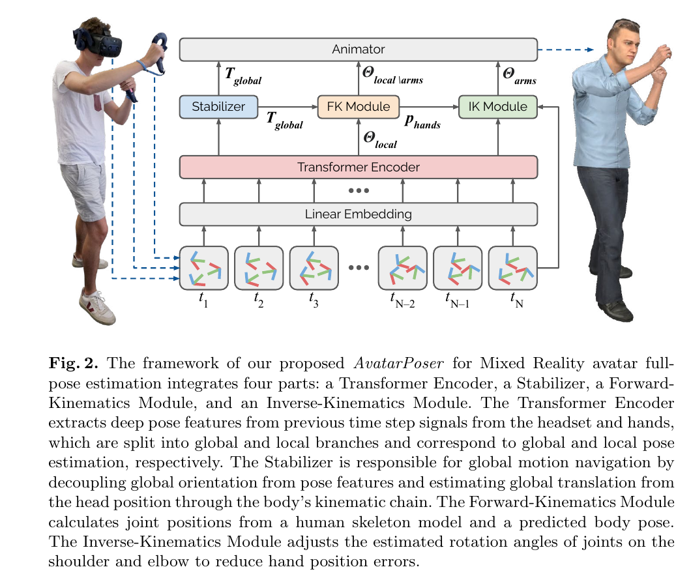
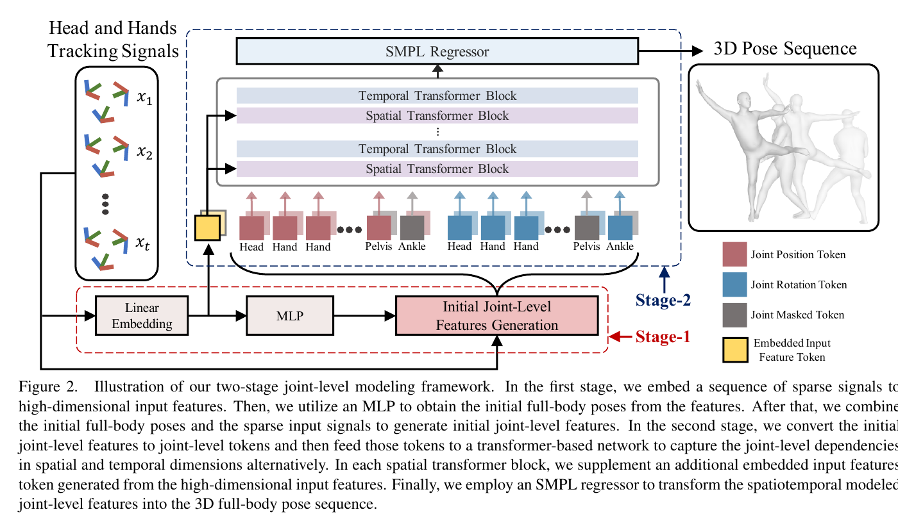
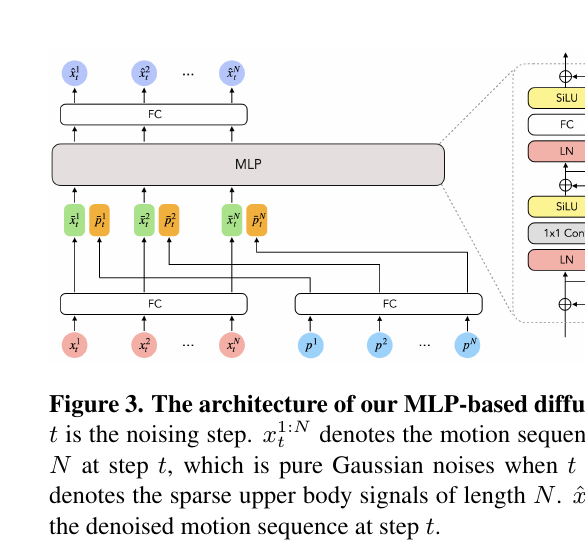
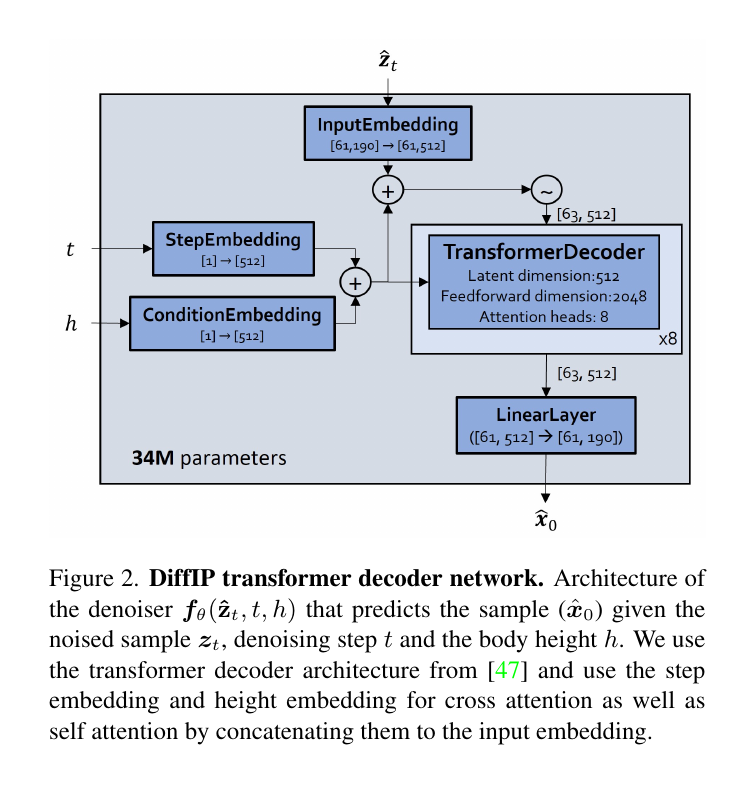
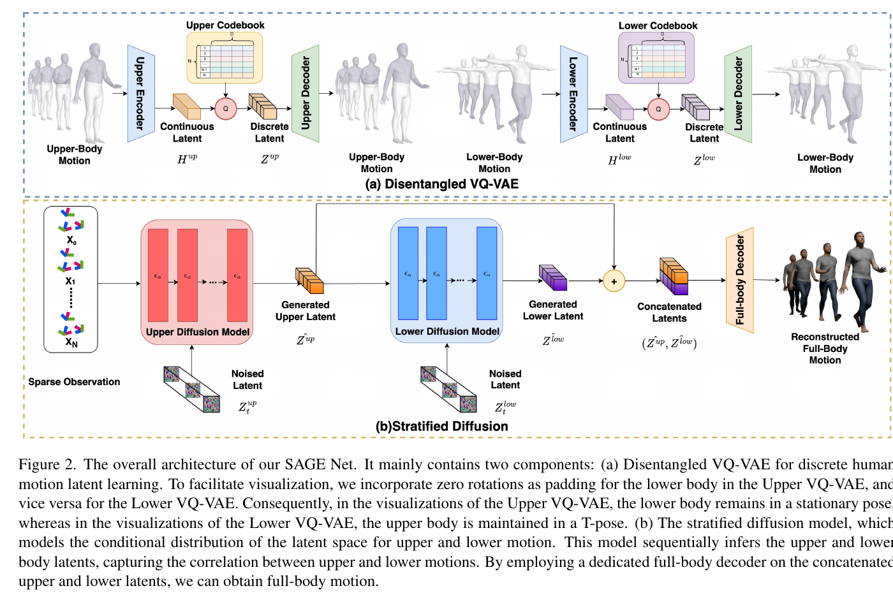
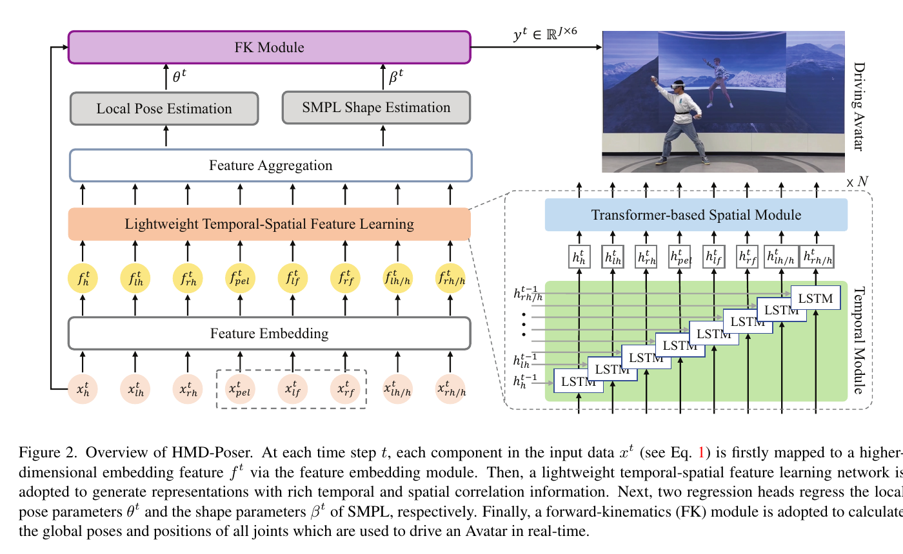
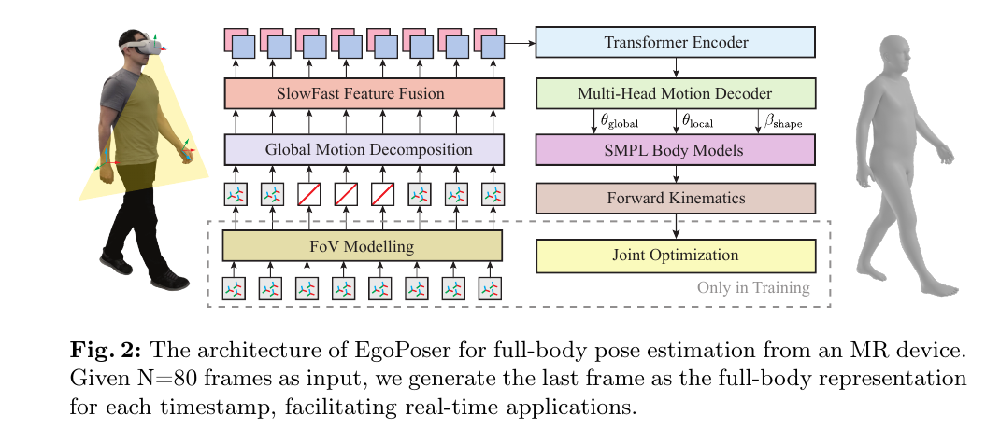
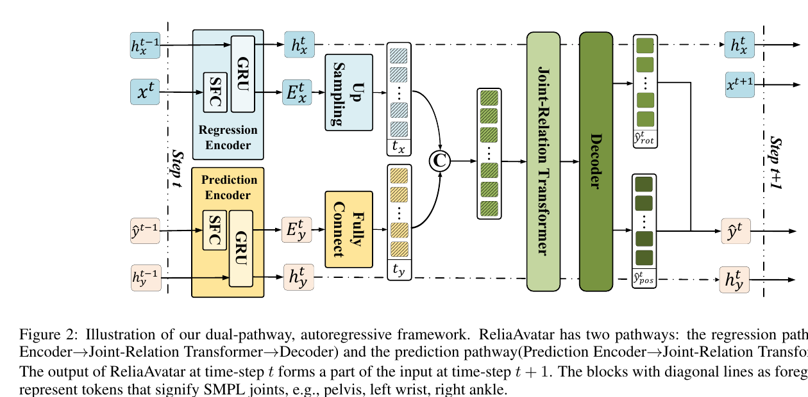
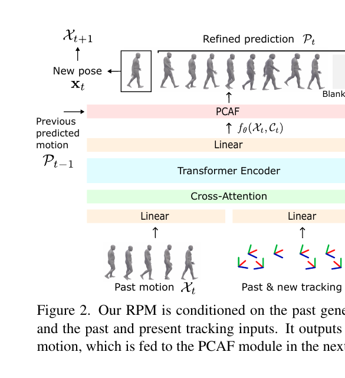
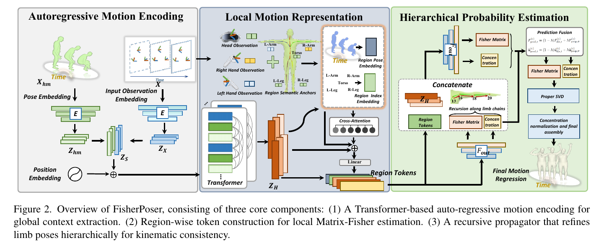

# 稀疏全身姿态估计相关工作汇总

> 更新时间：2026-08-03。范围以头显、控制器、IMU 等稀疏观测驱动全身姿态为主；AvatarPoser 作为 2022 年基础工作保留，其余工作集中于 2023—2026 年。

## 阅读说明

- 本文按“基础回归 → 生成式建模 → 可扩展与掉线鲁棒性 → 滚动预测与不确定性”组织。每篇论文均依次给出核心创新、架构图、方法和实验指标。
- “PDF p.x”按下载文件从第 1 页开始计数；原文图为论文 Figure 的高分辨率裁剪，仅用于研究笔记，版权归原作者和出版方所有。
- 所有实验数值均照录论文，不把窗口吞吐量换算为逐帧 FPS，也不把“能处理固定缺失配置”等同于“具备重连平滑机制”。未给出的模型规模、硬件或掉线指标统一写“未报告”。
- MPJPE、MPJRE、MPJVE、Jitter 和 FPS 只有在数据划分、输入配置、在线性、实现与硬件一致时才可横向比较。DiffusionPoser 的六 IMU 结果单独列出，不与三点 VR 输入直接排名。

## 总览

| 工作 | 年份 | 输入传感器 | 骨干网络 | 生成/回归范式 | 在线 | 掉线或缺失处理 | 模型规模 | 论文报告速度 |
|---|---:|---|---|---|---|---|---:|---|
| AvatarPoser [1] | 2022 | 头显 + 双手，3×6-DoF | Transformer Encoder + Stabilizer/FK/IK | 确定性回归 | 是，40 帧过去窗口 | 无专门掉线机制 | 未报告 | 最高 662 FPS，RTX 3090，仅网络 |
| AvatarJLM [3] | 2023 | 头显 + 双手，3×6-DoF | MLP + 交替空间/时间 Transformer | 确定性回归 | 是，41 帧过去窗口 | 训练时遮蔽关节 token；非真实 tracker 掉线 | 未报告 | 24.7 ms / 41 帧，A100 |
| AGRoL [2] | 2023 | 头显 + 双手姿态及速度，54D | 12-block MLP denoiser | 条件扩散 | 否，196 帧片段条件 | 推理测试随机遮蔽 10% 输入帧；无重连过渡 | 7.48M | 35 ms / 196 帧 / 5 DDIM，V100 |
| DiffusionPoser [4] | 2024 | 任意子集 IMU/压力等稀疏信号 | 8-layer Transformer Decoder | 自回归扩散补全 | 是，61 帧过去窗口 | inpainting mask；可全传感器掉线后自然回归 | 34M | 30 步在 A4000 实时；实演重建 45 ms |
| SAGE [6] | 2024 | 头显 + 双手姿态及速度，54D | VQ-VAE + 分层 latent diffusion + GRU | 分层生成 | 是，20 帧过去窗口 | 无专门掉线机制 | 未报告 | 0.74 ms / 帧，RTX 3090 |
| HMD-Poser [5] | 2024 | HMD；可选 2/3 个身体 IMU | 分量级 LSTM + 帧内 Transformer | 可扩展确定性回归 | 是，循环状态 | mask/zero-padding 支持预定义传感器组合；未评重连 | 未报告 | 205.7 Hz，RTX 3080；90 Hz，PICO 4 |
| EgoPoser [7] | 2024 | 头显 + 视场内双手 | SlowFast + Transformer Encoder | 确定性回归 | 是，80 帧过去窗口 | FoV 连续遮蔽训练；无显式重连混合 | 4.12M | 超过 600 FPS；测速硬件未报告 |
| ReliaAvatar [8] | 2024 | 头显 + 双手；可扩展骨盆 | 双路 SFC-GRU + Joint Transformer | 回归 + 运动预测 | 是，递归状态 | 瞬时/长时掉线训练；无显式重连插值 | 未报告 | 109.65 FPS，RTX 3090 |
| RPM [9] | 2025 | 头显 + 控制器或手追 | Cross-Attention Transformer + PCAF | 滚动多步预测 | 是，过去 10 帧并滚动预测未来 | 专门建模 tracking↔synthesis 过渡 | 未报告 | 206.5 FPS，A100 |
| FisherPoser [10] | 2026 | 头显 + 双手，3×6-DoF | Causal Transformer + 区域 Fisher heads | 概率回归 | 是，上一帧姿态反馈 | 无 tracker 掉线机制；输出关节不确定性 | 未报告 | 可实时处理 30 FPS 输入，RTX 4090；未给精确吞吐 |

## 一、基础回归

### AvatarPoser [1]

#### 核心创新

- 用一个时间 Transformer 从头显与双手的 6-DoF 历史恢复全身姿态，再把根节点稳定、正向运动学和手臂逆向运动学拆成明确的后处理链。
- 将全局平移与局部身体姿态解耦，建立了后来三点 VR 全身回归方法常用的 40 帧因果基线。

> 原文短引：“For inference, our network reaches rates of up to 662 fps.” —— §1，PDF p.3，[1]

#### 架构图

**原文图：Figure 2，PDF p.7，[1]。**

~~~mermaid
flowchart LR
    A["头显与双手 6-DoF 当前帧 + 39 帧历史"] --> B["线性嵌入"]
    B --> C["Transformer Encoder"]
    C --> D["全局平移 / 局部姿态分支"]
    D --> E["Stabilizer + FK"]
    E --> F["手臂 IK"]
    F --> G["全身姿态输出"]
~~~

#### 方法

- **输入输出与窗口：**60 Hz 下取当前帧及前 39 帧头、左手、右手的全局位置和旋转，网络预测 SMPL 身体旋转及根平移。
- **骨干与融合：**线性嵌入后进入 Transformer Encoder；输出拆成全局根运动和局部关节旋转，Stabilizer 估计稳定的全局平移，FK 得到关节位置，推理时再以 IK 对齐双臂。
- **训练与推理：**训练使用姿态旋转、全局旋转和 FK 位置约束；IK 仅在推理使用。模型只依赖当前及过去帧，**无未来帧依赖**；论文没有传感器掉线或重连恢复训练。

#### 实验指标

- **主要基准：**AMASS Protocol 1（CMU、BMLrub、HDM05 各 90%/10% 随机划分），三点 VR 输入，MPJRE **3.21°**、MPJPE **4.18 cm**、MPJVE **29.40 cm/s**；准确率测试硬件未报告；来源 Table 1，PDF p.11，[1]。
- **效率：**同一 AMASS 测试集、40 帧三点输入，单张 NVIDIA RTX 3090 上网络最高 **662 FPS**；不含 IK 后处理，故不是完整端到端速度；来源摘要及补充 §4.4 / Figure 6，PDF p.3、p.13，[1]。
- **掉线/平滑性：**没有掉线或重连实验；标准协议中的 Jitter 也未在该论文 Table 1 报告。

### AvatarJLM [3]

#### 核心创新

- 先用 MLP 产生初始全身关节特征，再把每个关节拆成位置 token 与旋转 token，交替执行空间和时间 Transformer，显式建模关节级关系。
- 每个空间块重复注入稀疏输入特征，并增加手部对齐、多时间跨度速度、脚接触与穿地约束，避免依赖推理期 IK。

> 原文短引：“Our method takes 24.7ms to infer 41 frames on an NVIDIA A100 GPU.” —— §3.3，PDF p.7，[3]

#### 架构图

**原文图：Figure 2，PDF p.2，[3]。**

~~~mermaid
flowchart LR
    A["头显与双手信号 当前帧 + 40 帧历史"] --> B["线性嵌入"]
    B --> C["MLP 初始全身姿态"]
    C --> D["关节位置 / 旋转 tokens"]
    D --> E["空间与时间 Transformer 交替"]
    A --> E
    E --> F["SMPL Regressor"]
    F --> G["当前帧全身姿态"]
~~~

#### 方法

- **输入输出与窗口：**每帧 54D 的三点姿态与速度，滑窗长度 41；输出 22 个关节的 6D 旋转，共 132D，并通过 SMPL/FK 得到三维关节。
- **骨干与融合：**Stage 1 用嵌入 + MLP 得到初始全身姿态；Stage 2 将初始位置/旋转转成关节 token，6 轮交替空间与时间 Transformer，并在每个空间块注入 Embedded Input Features。
- **训练与推理：**损失包含方向/旋转/位置、手部对齐、多步长速度、脚接触、穿透和脚高约束。滑窗只含当前与历史，**没有未来帧依赖**。训练遮蔽的是生成出的非头手关节 token，不等同于 tracker 掉线；未设计重连过渡。

#### 实验指标

- **主要基准：**AMASS Protocol 1，三点 VR 输入、41 帧在线窗口，MPJRE **2.90°**、MPJPE **3.35 cm**、MPJVE **20.79 cm/s**；准确率硬件未报告；来源 Table 1，PDF p.5，[3]。
- **效率：**41 帧三点输入在 NVIDIA A100 上一次推理 **24.7 ms**，不含后处理；这是窗口吞吐量，论文未给逐帧端到端延迟；来源 §3.3，PDF p.7，[3]。
- **平滑性：**同一 AMASS Protocol 1 与三点输入下 Jitter **8.39 × 10² m/s³**；硬件未报告；来源 Table 4，PDF p.7，[3]。没有真实 tracker 掉线或重连指标。

## 二、生成式建模

### AGRoL [2]

#### 核心创新

- 将三点 VR 全身动作恢复写成条件扩散，使用轻量 MLP 而不是时序 Transformer，并在每个残差块重复注入扩散步信息。
- 直接预测干净动作，配合 5 步 DDIM，在整段生成吞吐与动作平滑性之间取得折中。

> 原文短引：“We show that our lightweight diffusion-based model AGRoL can generate realistic smooth motions while achieving real-time inference speed.” —— §1，PDF p.2，[2]

#### 架构图

**原文图：Figure 3，PDF p.4，[2]。**

~~~mermaid
flowchart LR
    A["头/手姿态与速度 196 帧条件"] --> B["FC 条件编码"]
    C["高斯噪声动作序列"] --> D["12-block MLP 去噪器"]
    B --> D
    E["逐块扩散步嵌入"] --> D
    D --> F["5-step DDIM"]
    F --> G["196 帧全身动作"]
~~~

#### 方法

- **输入输出与窗口：**每帧三点位置、旋转及速度共 54D，条件长度 \(N=196\)；输出 22 个关节的 6D 旋转序列。超长序列以已生成片段继续自回归。
- **骨干与融合：**输入动作噪声与稀疏条件分别经 FC 编码，在 12 个 MLP block 中混合时间与通道信息；每块重新注入 timestep embedding，避免深层丢失扩散步。
- **训练与推理：**训练 1000 个扩散步并以 L2 目标直接预测干净动作；推理采用 5 步 DDIM。原始 196 帧片段以整段稀疏序列为条件，内部帧可看到其“未来观测”，因此**不是严格逐帧因果模型**；10% 随机帧遮蔽只验证缺失鲁棒性，没有重连混合。

#### 实验指标

- **主要基准：**AMASS Protocol 1、三点 VR 输入、196 帧离线片段，MPJRE **2.66°**、MPJPE **3.71 cm**、MPJVE **18.59 cm/s**、Jitter **7.26 × 10² m/s³**；单张 NVIDIA V100；来源 Table 1，PDF p.6，[2]。
- **效率：**196 帧三点输入、5 步 DDIM，一次生成 **35 ms**，单张 NVIDIA V100；这是整段生成时间，不换算逐帧 FPS；来源 §4.4.4，PDF p.8，[2]。
- **缺失鲁棒性：**AMASS 推理时随机遮蔽 **10% 输入帧**、重复 5 次取均值，MPJRE **4.20°**、MPJPE **6.38 cm**、MPJVE **96.85 cm/s**、Jitter **33.35 × 10² m/s³**；三点输入、V100；来源 Table 6，PDF p.8，[2]。

### DiffusionPoser [4]

#### 核心创新

- 通过统一的 inpainting mask，让同一个扩散模型接受任意数量与布局的 IMU、压力鞋垫等稀疏传感器，不需要为每种配置重新训练。
- 用 61 帧滚动窗口把历史重建结果与当前观测重新放回扩散过程；即使所有信号短时丢失，也能继续生成并在信号恢复后回到实测动作。

> 原文短引：“Once the signal is back, a natural transition to the actual motion is generated.” —— §4.5，PDF p.7，[4]

#### 架构图

**原文图：Figure 2，PDF p.4，[4]。**

~~~mermaid
flowchart LR
    A["任意稀疏传感器 + mask"] --> B["当前帧 + 60 帧历史"]
    C["带噪全身动作"] --> D["8-layer Transformer Decoder"]
    B --> D
    E["扩散步 + 身高条件"] --> D
    D --> F["DDIM 迭代补全"]
    F --> G["接触约束 / 根运动修正"]
    G --> H["当前帧全身姿态"]
    H --> B
~~~

#### 方法

- **输入输出与窗口：**统一动作状态为 \([61,190]\)：24 个关节的全局 6D 旋转、13 个候选 IMU 的三轴加速度、根节点水平位移增量与高度、4 个脚接触标签；mask 指定其中哪些值是观测。身高作为额外条件。
- **骨干与融合：**34M 参数的 8 层 Transformer Decoder，latent 512、FFN 2048、8 heads；扩散步和身高通过 cross-attention 融合，历史重建与当前传感器值通过 inpainting 固定。
- **训练与推理：**训练 1000 步扩散并预测 \(x_0\)，损失由 simple、velocity、FK、root drift 与 foot slide 组成。在线以 20 Hz 逐帧滚动，常用 30 个去噪步并做接触驱动的根运动修正。网络窗口只依赖当前及过去，但实测加速度的 166 ms 移动平均包含 **5 个未来采样点（83 ms look-ahead）**，因此完整实演管线并非零前视。
- **掉线恢复：**传感器值缺失时只取消相应 inpainting 约束，模型继续生成；恢复时新观测再次成为硬条件。论文仅给全传感器丢失数秒的定性视频，没有位置/角度重连跳变量。

#### 实验指标

- **六 IMU 基准（单列）：**TotalCaptureReal，骨盆、头、双腕、双小腿共 6 个 IMU，30 个去噪步；LA **13.0°**、GA **14.4°**、JPE **6.1 cm**、Jitter **2.8**、RE2s **0.14 m**、RE10s **0.25 m**；准确率硬件未单列；来源 Table 3，PDF p.7，[4]。这些指标不与三点 VR 表直接排名。
- **效率：**30 步在 NVIDIA A4000 上达到论文所称“real-time”，但未给精确 FPS；实时演示的重建算法延迟 **45 ms**，演示机型未单列，另有 83 ms 移动平均延迟；来源 §4.6 与 §5，PDF p.7–8，[4]。
- **掉线/步数折中：**全传感器掉线数秒后的恢复仅有定性结果，量化值**未报告**。六 IMU 下从 30 步降到 5 步时，GA **14.4°→16.0°**、Jitter **2.8→4.4**、RE2s **0.14→0.17 m**、RE10s **0.25→0.32 m**；硬件未单列；来源 Table 5，PDF p.8，[4]。

### SAGE [6]

#### 核心创新

- 用上下身解耦的 VQ-VAE 学习离散动作 latent，先生成上身，再以稀疏观测和上身 latent 为条件生成下身，从结构上利用人体运动的区域依赖。
- 将扩散放在压缩 latent 空间，并加入全身 Transformer decoder 与轻量 GRU Refiner，在 20 帧在线滑窗中兼顾生成能力和速度。

> 原文短引：“This model sequentially infers the upper and lower body latents, capturing the correlation between upper and lower motions.” —— Figure 2 caption，PDF p.4，[6]

#### 架构图

**原文图：Figure 2，PDF p.4，[6]。**

~~~mermaid
flowchart LR
    A["头显与双手 6-DoF + 速度 20 帧窗口"] --> B["稀疏观测编码"]
    B --> C["上身 latent diffusion"]
    C --> D["下身 latent diffusion"]
    B --> D
    D --> E["上下身 latent 拼接"]
    E --> F["全身 Transformer Decoder"]
    F --> G["GRU Refiner"]
    G --> H["当前帧全身姿态"]
~~~

#### 方法

- **输入输出与窗口：**每帧三点姿态及速度共 54D，在线窗口固定为 20 帧，只保留输出序列最后一帧；输出 22 个关节的 6D 旋转。
- **骨干与融合：**上下身各自使用 VQ-VAE，codebook 为 512×384、时间下采样率 2。两个 latent diffusion 均采用 12 个 DiT block（8 heads、embedding 512）；下身生成同时看稀疏观测与预测的上身 latent；随后由 6 层全身 Transformer decoder 与 2 层 GRU Refiner 输出。
- **训练与推理：**VQ-VAE 使用重建与 codebook 约束；latent diffusion 训练 1000 步并直接预测干净 latent；decoder 加旋转、FK 和手部约束，Refiner 用速度损失。推理窗口只含过去和当前帧，**无未来观测依赖**；论文未给具体推理采样步数，也没有 tracker 掉线恢复机制。

#### 实验指标

- **主要基准：**AMASS Setting S1、三点 VR 输入、20 帧在线滑窗，MPJRE **2.53°**、MPJPE **3.28 cm**、MPJVE **20.62 cm/s**、Jitter **6.55 × 10² m/s³**；准确率硬件未单列；来源 Table 1，PDF p.6，[6]。
- **效率：**同一三点输入在线设置，单张 NVIDIA RTX 3090 上 **0.74 ms/帧**；论文未报告总参数量；来源 §3.3，PDF p.5，[6]。
- **掉线/重连：**未报告传感器掉线、重连跳变或专门的连续遮蔽实验。

## 三、可扩展与掉线鲁棒性

### HMD-Poser [5]

#### 核心创新

- 以统一的 8 个输入分量和 mask/zero-padding 覆盖 HMD-only、HMD+2 IMUs、HMD+3 IMUs，避免每种传感器组合维护独立网络。
- 每个输入分量用单向 LSTM 保存时间状态，只让 Transformer 在当前帧的分量之间做空间交互，把注意力序列长度从时间窗口缩短到 8。

> 原文短引：“With the help of the hidden state in LSTM, the input length and computational cost of the Transformer are significantly reduced.” —— §1，PDF p.2，[5]

#### 架构图

**原文图：Figure 2，PDF p.3，[5]。**

~~~mermaid
flowchart LR
    A["HMD + 可选身体 IMU mask / zero-padding"] --> B["分量级特征嵌入"]
    B --> C["8 路单向 LSTM"]
    C --> D["帧内 Transformer 空间融合"]
    D --> E["特征聚合"]
    E --> F["局部姿态头 + SMPL 形状头"]
    F --> G["FK"]
    G --> H["全身姿态输出"]
~~~

#### 方法

- **输入输出与状态：**135D 输入包含头、双手及可选骨盆/腿部 IMU，并加入手相对头的表示；缺席分量置零并由 mask 区分。训练使用 40 帧序列，部署时逐帧更新循环状态。
- **骨干与融合：**每个输入分量由单层单向 LSTM（hidden 256）编码时间信息；当前帧 8 个分量 token 进入 3 层、8-head、FFN 256 的 Transformer Encoder，再聚合到姿态头和形状头，最后 FK 得到全局关节。
- **训练与推理：**损失包含根方向、局部/全局旋转、关节位置和加速度平滑。单向 LSTM 只用过去状态，**无未来帧依赖**。可扩展 mask 面向固定传感器配置，论文没有模拟运行中断连与重连。

#### 实验指标

- **主要基准：**AMASS Protocol 1，HMD-only（三点头手）输入，MPJRE **2.28°**、MPJPE **3.19 cm**、MPJVE **17.47 cm/s**、Jitter **6.07 × 10² m/s³**；准确率硬件未单列；来源 Table 1，PDF p.5，[5]。同表 HMD+3 IMUs 为 **1.73° / 1.89 cm / 11.03 cm/s / 5.35**，仅说明增加传感器后的上限。
- **效率：**同一实现比较下，NVIDIA GeForce RTX 3080 为 **205.7 Hz**，PICO 4 端侧为 **90.0 Hz**；输入为 HMD-Poser 支持的可扩展配置；来源 Table 6 / §4.3，PDF p.8，[5]。
- **掉线/重连：**未报告瞬时掉线、长时掉线或重连跳变；不能把不同静态 sensor mask 的可用性直接视为掉线恢复能力。

### EgoPoser [7]

#### 核心创新

- 按头显视场几何模拟双手连续不可见区间，使训练缺失模式接近 inside-out hand tracking，而不是独立随机遮蔽。
- 通过全局运动分解消除对 mocap 原点的依赖，并用 SlowFast 采样在相同 token 数下覆盖更长的 80 帧历史；同时预测用户体型。

> 原文短引：“We train our method to robustly handle inputs with continuous tracking gaps.” —— §3.2，PDF p.6，[7]

#### 架构图

**原文图：Figure 2，PDF p.5，[7]。**

~~~mermaid
flowchart LR
    A["头显 + 视场内双手 80 帧历史"] --> B["FoV mask"]
    B --> C["全局运动分解"]
    C --> D["SlowFast 特征融合"]
    D --> E["Transformer Encoder"]
    E --> F["多头动作 Decoder"]
    F --> G["SMPL + FK"]
    G --> H["当前帧姿态与体型"]
~~~

#### 方法

- **输入输出与窗口：**使用最近 80 帧头手信号；SlowFast 分支保留最近 40 帧密集样本，并从 80 帧中按 stride 2 取 40 帧长程样本，融合后预测最后一帧的根方向、局部姿态和形状。
- **骨干与融合：**先依据相机 FoV 构造手部有效 mask，再以时间/空间归一化分解全局运动；59D 特征经 SlowFast、Transformer Encoder 和多头动作 Decoder，最后通过 SMPL/FK 与头部对齐得到全局人体。
- **训练与推理：**损失为方向、旋转、关节位置和形状的 L1 约束；形状优化只在训练使用。模型只看当前与过去，**无未来帧依赖**。连续手部缺失由 FoV 遮蔽训练覆盖，但恢复时没有专门的 blend/PCAF。

#### 实验指标

- **主要基准：**AMASS 三点输入与论文默认全局运动分解，MPJPE **4.14 cm**、MPJVE **25.95 cm/s**；测试协议为论文 AMASS 90%/10% 设置，准确率硬件未报告；来源 Table 4，PDF p.12，[7]。
- **效率：**SlowFast 的 80 帧、stride 2 配置为 **4.12M 参数、0.33 GFLOPs**；论文另报推理超过 **600 FPS**，但测速硬件未报告（训练硬件为单张 GTX 3090，不能据此代替测速硬件）；来源 Table 5 与摘要，PDF p.12、p.1，[7]。
- **连续缺失：**AMASS、三点输入、FoV=90° 时 MPJPE **6.60 cm**、MPJVE **48.25 cm/s**；硬件未报告；来源 Table 3，PDF p.12，[7]。论文未报告重连瞬间的位置/角度跳变。

### ReliaAvatar [8]

#### 核心创新

- 用双路自回归框架同时编码当前稀疏观测和上一时刻完整姿态预测，即使当前 tracker 丢失，预测路径仍可维持动作状态。
- 将两路特征上采样为关节 token，再以 Joint-Relation Transformer 融合；训练同时覆盖标准、瞬时缺失和后半段连续缺失三种信号质量。

> 原文短引：“ReliaAvatar operates effectively, with an impressive performance rate of 109 frames per second.” —— Abstract，PDF p.1，[8]

#### 架构图

**原文图：Figure 2，PDF p.4，[8]。**

~~~mermaid
flowchart LR
    A["当前头/手稀疏信号"] --> B["Regression SFC + GRU"]
    C["上一帧完整姿态"] --> D["Prediction SFC + GRU"]
    B --> E["上采样为关节 tokens"]
    D --> E
    E --> F["Joint-Relation Transformer"]
    F --> G["SFC Decoder"]
    G --> H["当前全身姿态"]
    H --> C
~~~

#### 方法

- **输入输出与状态：**当前三点信号每个 tracker 为 18D，历史完整姿态为 396D；训练以 \(L=32\) 展开，推理逐帧递归，不再重算固定历史窗口。
- **骨干与融合：**回归路径和预测路径分别使用 SFC + GRU，随后上采样为 22 个关节 token，拼接后进入 4 层、latent 512 的 Joint-Relation Transformer，再由 SFC decoder 输出旋转和位置。
- **训练与推理：**损失包含方向、旋转、SMPL 位置、decoder 位置和速度 L1。训练样本等比例覆盖标准信号、瞬时 tracker dropout（\(p=0.1\)）和序列后半段连续丢失。单步推理仅用当前信号与历史状态，**无未来帧依赖**；信号恢复时由双路状态吸收，但没有显式重连插值。

#### 实验指标

- **主要基准：**AMASS 标准场景、头与双腕三输入，MPJRE **2.53°**、MPJPE **3.18 cm**、MPJVE **18.30 cm/s**；准确率硬件未报告；来源 Table 2，PDF p.6，[8]。
- **效率：**三输入逐帧推理，在单张 NVIDIA RTX 3090 上重复 10,000 次测得 **109.65 FPS**；来源 Table 7，PDF p.7，[8]。
- **长时掉线：**AMASS，每 80 帧中连续丢失 \(M=60\) 帧的头手信号，MPJRE **4.70°**、MPJPE **7.69 cm**、MPJVE **45.02 cm/s**；硬件未报告；来源 Table 5，PDF p.6，[8]。重连瞬间跳变未单列。

## 四、滚动预测与不确定性

### RPM [9]

#### 核心创新

- 不只回归当前姿态，而是每帧维护未来 \(W\) 帧的滚动预测；新观测到来时逐步修正原预测，从结构上降低突然“吸附”到 tracker 的跳变。
- PCAF 根据预测距离当前时刻的远近限制每个未来位置的修正幅度，并用 free-running 训练让模型在长时无信号时依靠自身预测继续生成。

> 原文短引：“RPM generates seamless transitions from tracking to synthesis, and vice versa.” —— Abstract，PDF p.1，[9]

#### 架构图

**原文图：Figure 2，PDF p.3，[9]。**

~~~mermaid
flowchart LR
    A["过去动作 10 帧"] --> C["Cross-Attention Transformer"]
    B["过去与当前 tracking 10 帧"] --> C
    C --> D["未来 W 帧粗预测"]
    D --> E["PCAF 渐进修正"]
    E --> F["输出最近一帧姿态"]
    E --> G["保存并滚动未来预测"]
    G --> A
~~~

#### 方法

- **输入输出与窗口：**上下文通常为过去动作 \(M=10\) 帧和 tracking \(I=10\) 帧，网络预测当前至未来 \(W\) 帧；Reactive 配置在 A-P1 使用 \(W=10\)，Smooth 配置使用 \(W=20\)。输出第一帧作为当前姿态，其余预测滚动到下一时刻。
- **骨干与融合：**过去动作及 blank future tokens 形成 query，与头手 tracking 特征 cross-attention 后进入 4 层 Transformer Encoder（latent 512），线性头生成整段预测；PCAF 用随预测时距变化的不确定性权重渐进修正上一轮预测。
- **训练与推理：**方向、旋转、位置及对应速度使用 L1 约束；随后 free-running 60 帧，以模型自身输出作为历史，并模拟分段信号丢失。部署只消费当前/过去观测，虽然内部预测未来，但**不使用真实未来帧**；tracking 与 synthesis 的切换由 PCAF 显式平滑。

#### 实验指标

- **主要基准：**A-P1、模拟 Hand Tracking、头显+双手、随机丢失区间 0.5–2 s，RPM-Reactive 的 MPJRE **3.82°**、MPJPE **5.18 cm**、MPJVE **22.83 cm/s**、Jitter **4.35 × 10² m/s³**；准确率硬件未单列；来源 Table 1，PDF p.6，[9]。
- **效率：**同一论文实现的 RPM 为 **206.5 FPS**，单张 NVIDIA A100；模型规模未报告；来源实现细节段落，PDF p.5，[9]。
- **重连/切换平滑性：**上述 A-P1 Hand Tracking 协议，RPM-Reactive 的 AUJ tracking→synthesis 为 **60.51 × 10² m/s²**，synthesis→tracking 为 **69.02 × 10² m/s²**；硬件未单列；来源 Table 1，PDF p.6，[9]。这是 1 秒过渡区间的 jerk 面积，不是位置或角度跳变量。

### FisherPoser [10]

#### 核心创新

- 不再为每个关节只输出一个旋转，而是在 \(SO(3)\) 上输出 Matrix Fisher 分布；其 mode 给出姿态，concentration 直接表达未观测肢体的不确定性。
- 将人体划分为躯干、双臂和双腿五个区域，以语义 anchor 聚合区域 token，再按运动学父子顺序递归传播 Fisher 参数，使区域可观测性和骨架层级共同约束预测。

> 原文短引：“the lower the concentration, the higher uncertainty.” —— Figure 4 caption，PDF p.7，[10]

#### 架构图

**原文图：Figure 2，PDF p.4，[10]。**

~~~mermaid
flowchart LR
    A["当前三点 VR 信号"] --> C["共享嵌入 + Causal Transformer"]
    B["上一帧预测姿态"] --> C
    C --> D["五个区域 tokens"]
    D --> E["区域 Matrix Fisher heads"]
    E --> F["父到子层级细化"]
    F --> G["SVD mode + concentration"]
    G --> H["全身姿态 + 关节不确定性"]
    H --> B
~~~

#### 方法

- **输入输出与状态：**当前帧头和双手的位置、速度、3×3 旋转共 45D；上一帧预测的全身姿态历史为 198D。训练片段长 40 帧，推理时使用上一时刻模型输出并流式前进。
- **骨干与融合：**两类输入映射到 256D，共享 3 层 causal Transformer（4 heads、FFN 1024）；注意力池化生成躯干、左右臂、左右腿 token，并融合头/手等语义 anchor。
- **训练与推理：**每区域预测 Matrix Fisher 参数，四肢按父到子只细化一次，SVD 得到旋转 mode 与 concentration；损失为 Matrix Fisher NLL、mode geodesic、手部对齐、多步长速度与脚接触。模型**无未来帧依赖**，但没有 tracker 掉线或重连机制。

#### 实验指标

- **主要基准：**AMASS Protocol 1（CMU、BMLrub、HDM05 各 90%/10%）、60 FPS、头显+双手三点输入，MPJRE **2.04°**、MPJPE **29.7 mm**、MPJVE **205.2 mm/s**、Jitter **5.33 × 10² m/s³**；单张 NVIDIA RTX 4090 24 GB；来源 Table 1（主文 PDF p.7）与补充实验设置（补充 PDF p.2–3），[10]。
- **效率：**RTX 4090 上能实时处理 **30 FPS 输入序列**，但论文没有给精确推理 FPS、单帧延迟、FLOPs 或参数量；来源补充 §1，PDF p.2，[10]。
- **不确定性消融：**同一 AMASS P1、三点输入与 RTX 4090，确定性 Ours-AR 为 **4.26° / 63.2 mm / 240.7 mm/s / 8.06**，完整 FisherPoser 为 **2.04° / 29.7 mm / 205.2 mm/s / 5.33**（MPJRE/MPJPE/MPJVE/Jitter）；来源 Table 2，PDF p.8，[10]。这是不确定性建模消融，不是掉线结果。

## 协议与速度对照注意事项

1. **三点 VR 与六 IMU 不同任务。**AvatarPoser、AGRoL、AvatarJLM、HMD-Poser、SAGE、EgoPoser、ReliaAvatar、RPM 和 FisherPoser 的主要输入是头显与双手；DiffusionPoser 的主量化结果来自骨盆、头、双腕、双小腿六 IMU，观测量和误差定义都不同。
2. **同名 Protocol 1 仍可能有实现差异。**不同论文会重训基线、改变帧率、SMPL/SMPL-X、速度特征或后处理，因此同一方法在后续论文表中的数字可能与原论文不同；本文优先记录各工作自己的报告值。
3. **窗口吞吐不等于端到端延迟。**AGRoL 的 35 ms 是 196 帧整段生成，AvatarJLM 的 24.7 ms 是 41 帧一次推理，AvatarPoser 的 662 FPS 只含网络；这些数值不能直接与逐帧含预处理、采样、FK、通信和 Unity 执行的延迟比较。
4. **“实时”阈值不同。**有的论文以 20/30 Hz 输入可跟上为实时，有的报告 GPU 极限吞吐；只有 HMD-Poser 给出了独立头显上的 90 Hz 结果。

## 对当前项目的可借鉴点

| 方向 | 最相关工作 | 可直接借鉴的设计 | 对当前项目的含义 | 是否需要重新训练 |
|---|---|---|---|---|
| 扩散补全 | DiffusionPoser、AGRoL、SAGE | observed values 作为硬 inpainting 条件；latent/少步采样 | 当前任意 tracker 条件可统一成 mask；但减少去噪步要用质量曲线验证 | 通常需要；仅 ONNX 图优化不需要 |
| 动态 Tracker | DiffusionPoser、HMD-Poser | mask + zero-padding；统一信号槽位 | 避免为每种 Tracker 组合维护模型，同时明确 valid mask 语义 | 若训练未覆盖组合则需要 |
| 重连过渡 | RPM、ReliaAvatar、DiffusionPoser | 滚动未来预测 + PCAF；预测状态分支；恢复后再约束 | 对当前约 8.0 cm / 11.97° 重连跳变，RPM 是最直接的结构参考 | PCAF/双路状态需要；纯输出 blend 可先作为部署实验 |
| 区域建模 | SAGE、FisherPoser | 上下身分层；五区域 token；父到子细化 | 可减少全关节重复的全局混合，并让腿部生成单独分配容量 | 需要 |
| 不确定性 | FisherPoser、RPM | Matrix Fisher concentration；按预测时距设修正强度 | 可用低置信度触发更平滑的约束恢复，而不是信号一回来就硬吸附 | 概率头需要；规则式置信度门控可先试 |
| 实时部署 | HMD-Poser、EgoPoser、AGRoL | 递归时间状态 + 帧内空间注意力；SlowFast；轻量 MLP | 对 60 FPS 的 16.67 ms 预算，优先消除重复历史编码并在 Sentis/ONNX 中融合常量与算子 | 部署图优化可无损；换骨干需重训 |

### 面向当前实现的优先级

1. **先做部署侧无损项：**固定 shape、常量折叠、LayerNorm/Linear 等算子融合、ONNX Runtime 与 Unity Sentis 的同输入 profile、缓存不随当前帧变化的条件嵌入；这些不改变模型函数，但是否提速必须以目标 Unity 设备实测。
2. **再验证低风险推理折中：**像 DiffusionPoser Table 5 一样画出采样步数—误差—Jitter 曲线。减少采样步不是数学上的无损压缩，不能在尚无有效 checkpoint 时先假设等价。
3. **重连问题单独建指标：**除现有位置/角度跳变外，增加 RPM 的 1 秒过渡 AUJ/PJ 或等价连续性指标，区分“掉线期间合理”与“恢复瞬间不跳”。
4. **结构改动最后做消融：**HMD-Poser 的循环时间缓存、SAGE/FisherPoser 的区域化、RPM 的 PCAF 都会改变学习问题；应保留基线后逐项训练，不应称为无损压缩。

## 旁支脉络（本文不展开）

为保持十篇正文精简，HMD-NeMo、BoDiffusion、EnvPoser、SSD-Poser、Mem-MLP、S²Fusion 和 Ultra Diffusion Poser 仅作为后续检索候选，不按四项结构展开。后续若重点转向环境约束、端侧蒸馏或更少扩散步，可再按同一模板补入，并保持协议隔离。

## 参考文献

[1] Jiaxi Jiang, Paul Streli, Huajian Qiu, Andreas Fender, Larissa Laich, Patrick Snape, Christian Holz. **AvatarPoser: Articulated Full-Body Pose Tracking from Sparse Motion Sensing.** ECCV 2022. [官方论文](https://www.ecva.net/papers/eccv_2022/papers_ECCV/papers/136650434.pdf) · [项目页](https://siplab.org/projects/AvatarPoser) · [代码](https://github.com/eth-siplab/AvatarPoser)

[2] Yuming Du, Robin Kips, Albert Pumarola, Sebastian Starke, Ali K. Thabet, Artsiom Sanakoyeu. **Avatars Grow Legs: Generating Smooth Human Motion from Sparse Tracking Inputs with Diffusion Models.** CVPR 2023. [官方论文](https://openaccess.thecvf.com/content/CVPR2023/papers/Du_Avatars_Grow_Legs_Generating_Smooth_Human_Motion_From_Sparse_Tracking_CVPR_2023_paper.pdf) · [项目页](https://dulucas.github.io/agrol/) · [代码](https://github.com/facebookresearch/AGRoL)

[3] Xiaozheng Zheng, Zhuo Su, Chao Wen, Zhou Xue, Xiaojie Jin. **Realistic Full-Body Tracking from Sparse Observations via Joint-Level Modeling.** ICCV 2023. [官方论文](https://openaccess.thecvf.com/content/ICCV2023/html/Zheng_Realistic_Full-Body_Tracking_from_Sparse_Observations_via_Joint-Level_Modeling_ICCV_2023_paper.html) · [项目页](https://zxz267.github.io/AvatarJLM/) · [代码](https://github.com/zxz267/AvatarJLM)

[4] Tom Van Wouwe, Seunghwan Lee, Antoine Falisse, Scott Delp, C. Karen Liu. **DiffusionPoser: Real-time Human Motion Reconstruction From Arbitrary Sparse Sensors Using Autoregressive Diffusion.** CVPR 2024. [官方论文](https://openaccess.thecvf.com/content/CVPR2024/papers/Van_Wouwe_DiffusionPoser_Real-time_Human_Motion_Reconstruction_From_Arbitrary_Sparse_Sensors_Using_CVPR_2024_paper.pdf) · [项目页](https://diffusionposer.github.io/) · 代码：未公开

[5] Peng Dai, Yang Zhang, Tao Liu, Zhen Fan, Tianyuan Du, Zhuo Su, Xiaozheng Zheng, Zeming Li. **HMD-Poser: On-Device Real-time Human Motion Tracking from Scalable Sparse Observations.** CVPR 2024. [官方论文](https://openaccess.thecvf.com/content/CVPR2024/html/Dai_HMD-Poser_On-Device_Real-time_Human_Motion_Tracking_from_Scalable_Sparse_Observations_CVPR_2024_paper.html) · [官方项目索引](https://pico-ai-team.github.io/) · [代码](https://github.com/Pico-AI-Team/HMD-Poser)

[6] Han Feng, Wenchao Ma, Quankai Gao, Xianwei Zheng, Nan Xue, Huijuan Xu. **Stratified Avatar Generation from Sparse Observations.** CVPR 2024. [官方论文](https://openaccess.thecvf.com/content/CVPR2024/html/Feng_Stratified_Avatar_Generation_from_Sparse_Observations_CVPR_2024_paper.html) · [项目页](https://fhan235.github.io/SAGENet/) · [代码](https://github.com/Wenchao-M/SAGE)

[7] Jiaxi Jiang, Paul Streli, Manuel Meier, Christian Holz. **EgoPoser: Robust Real-Time Egocentric Pose Estimation from Sparse and Intermittent Observations Everywhere.** ECCV 2024. [官方论文](https://www.ecva.net/papers/eccv_2024/papers_ECCV/html/248_ECCV_2024_paper.php) · [项目页](https://siplab.org/projects/EgoPoser) · [代码](https://github.com/eth-siplab/EgoPoser)

[8] Bo Qian, Zhenhuan Wei, Jiashuo Li, Xing Wei. **ReliaAvatar: A Robust Real-Time Avatar Animator with Integrated Motion Prediction.** IJCAI 2024. [官方论文](https://www.ijcai.org/proceedings/2024/0346) · 项目页：未单列 · 代码：论文所列 GitHub 仓库截至 2026-08-03 返回 404，未找到可验证替代地址

[9] German Barquero, Nadine Bertsch, Manojkumar Marramreddy, Carlos Chacón, Filippo Arcadu, Ferran Rigual, Nicky Sijia He, Cristina Palmero, Sergio Escalera, Yuting Ye, Robin Kips. **From Sparse Signal to Smooth Motion: Real-Time Motion Generation with Rolling Prediction Models.** CVPR 2025. [官方论文](https://openaccess.thecvf.com/content/CVPR2025/papers/Barquero_From_Sparse_Signal_to_Smooth_Motion_Real-Time_Motion_Generation_with_CVPR_2025_paper.pdf) · [项目页](https://barquerogerman.github.io/RPM/) · [代码](https://github.com/facebookresearch/motion_rolling_prediction)

[10] Songpengcheng Xia, Qingyu Zhang, Zhuo Su, Jiarui Yang, Zengyuan Lai, Qi Wu, Ling Pei. **FisherPoser: Human Motion Estimation from Sparse Observations with Hierarchical Region-Wise Fisher-Matrix Uncertainty Modeling.** CVPR 2026. [官方论文](https://openaccess.thecvf.com/content/CVPR2026/html/Xia_FisherPoser_Human_Motion_Estimation_from_Sparse_Observations_with_Hierarchical_Region-Wise_CVPR_2026_paper.html) · 项目页：未单列 · 代码：未公开
