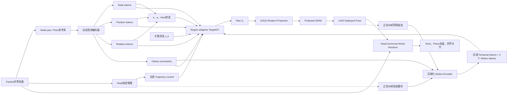

## 1. 总体架构

模型近似：

\[ p_\theta \left( x_n\mid H_{n-60:n-1}, \tau_{n-60:n-1}, \tau_n, Y_n,Q_n \right). \]

其中：

- 历史和 motion latent 提供运动先验；
- 当前 Tracker 提供稀疏观测；
- 当前 Head trajectory 提供运动控制；
- hard projection 保证稳定旋转；
- Head 世界位置解析恢复人物平移。

### 上游输入假设

Tracker 标定由 Unity 实时端完成。进入模型前，各 Tracker 的位置和旋转已经转换为对应关节的测量，算法侧默认 Tracker 与映射关节重合：

\[ p^W_{T_i}=p^W_{j_i},\qquad R^W_{T_i}=R^W_{j_i}. \]

因此本文档不建模 Tracker 安装偏移、旋转标定矩阵或标定误差。

------

## 2. 坐标系

当前参考系 \(C_n\) 的旋转由 Head yaw 决定：

\[ R_{C_n}^{W} = [\bar r_n,e_y,\bar f_n]. \]

原点保留当前代码定义：

\[ o_n^W= [p^W_{H,n,x},floor_y,p^W_{H,n,z}]^\top. \]

Tracker 变换为：

\[ p_{i,n}^{C_n} = (R_{C_n}^{W})^\top(p^W_{i,n}-o_n^W), \]\[ R_{i,n}^{C_n} = (R_{C_n}^{W})^\top R^W_{i,n}. \]

因此当前 Head 位置为：

\[ p_{H,n}^{C_n}=[0,h_{head,n},0]^\top. \]

Head position 不作为普通 measurement token；Head height 进入 trajectory，Head世界位置用于最终Root解析。

当Head forward接近竖直时，沿用上一帧合法yaw，避免水平投影退化。

### 历史参考系

Motion Encoder 的历史统一表达在 \(C_{n-1}\)：

\[ H^{motion}_n = H^{C_{n-1}}_{n-60:n-1}. \]

当前 \(C_{n-1}\rightarrow C_n\) 的变化只通过当前 trajectory control 输入，因此 motion latent 保持严格 past-only。

------

## 3. 输入契约

| 输入                | 形状          | 含义                   |
| ------------------- | ------------- | ---------------------- |
| Diffusion state     | `[B,144]`     | 当前噪声姿态           |
| Pose history        | `[B,60,144]`  | 在 \(C_{n-1}\) 中的过去 deployed pose |
| Tracker history     | `[B,60,6,13]` | 在 \(C_{n-1}\) 中的过去动态观测       |
| Current Tracker     | `[B,6,13]`    | 在 \(C_n\) 中的当前观测与状态          |
| Past trajectory     | `[B,60,5]`    | 独立滚动缓存           |
| Current trajectory  | `[B,1,5]`     | 当前Head运动控制       |
| Skeleton offsets    | `[B,24,3]`    | FK与世界解析使用的目标骨架偏移          |
| 主输出              | `[B,144]`     | Head-yaw参考系全局旋转 |

每个Tracker的13维状态为：

\[ O_{i,n} = [y^p_{i,n},y^R_{i,n}, c_{i,n},v_{i,n}, d^{off}_{i,n},d^{on}_{i,n}]. \]

Tracker identity \(q_i\) 由索引embedding提供。

------

## 4. 独立Trajectory缓存

5D轨迹定义为：

\[ \tau_n= [ \Delta p^{C_{n-1}}_{x,n}, \Delta p^{C_{n-1}}_{z,n}, h^{norm}_{head,n}, \sin\Delta\psi_n, \cos\Delta\psi_n ]. \]

其中：

\[ \Delta p_n^{C_{n-1}} = (R_{C_{n-1}}^W)^\top (p^W_{H,n}-p^W_{H,n-1}). \]

\(h^{norm}_{head,n}\) 是 Head 相对地面高度经过固定数据归一化后的结果；离线数据生成与 Unity 实时端使用同一归一化规则，模型不接收用户标定参数。

每帧开始时：

- 缓存保存过去60个 \(\tau\)；
- 当前 \(\tau_n\) 单独编码；
- 推理结束后弹出最旧值并写入 \(\tau_n\)；
- 启动阶段缺少的历史补零并配合 valid mask。

------

## 5. 动态观测编码器

每个Tracker产生四类token。

### State token

\[ s_{i,n} = E_s(q_i,c_i,v_i,d^{off}_{i,n},d^{on}_{i,n}). \]

解释Tracker是未配置、掉线、刚恢复还是稳定。

### Position token

\[ m^p_{i,n}=E_p(y^p_{i,n}). \]

仅对非Head Tracker建立。Head position不进入该分支。

### Rotation token

\[ m^R_{i,n}=E_R(y^R_{i,n}). \]

Head rotation保留，其中yaw用于参考系，pitch/roll仍提供姿态条件。

### History summary

\[ u_{i,n} = E_{history}(O_{i,n-60:n-1}). \]

掉线时measurement关闭，但state和history继续存在。

------

## 6. 可靠性和区域覆盖度

逐Tracker、逐模态可靠性：

\[ \kappa_i^a = c_i v_i \min\left(1,\frac{d_i^{on}}{D^a_{warm,i}}\right), \qquad a\in\{p,R\}. \]

不引入额外的观测质量通道；掉线立即令可靠度归零，重连后仅按连续有效时长平滑恢复。

区域覆盖度：

\[ \rho_r^a = 1-\prod_i(1-A^a_{r,i}\kappa_i^a). \]

区域为：

\[ \{torso/pelvis,left\ arm,right\ arm,left\ leg,right\ leg\}. \]

设置：

\[ A^p_{r,head}=0, \]

因为Head位置负责世界平移，而不是相对姿态测量。

默认参数固定为：

- `D_warm_pos = 15`、`D_warm_rot = 15`、`D_h = 15`；
- `d_off/d_on` 上限为 60。

------

## 7. Frame-level Hard Gate

除 Head 外，每个可硬约束 Tracker 的当前状态直接由有效性和连续恢复时长决定：

\[ h^R_{i,n}=c_{i,n}v_{i,n}\,\mathbb{1}\!\left[d^{on}_{i,n}\ge D_h\right]. \]

掉线或取消配置时立即退出hard。

Head rotation始终hard。其余Tracker重连后先由 \(\kappa\) 逐帧增加 soft conditioning 影响，连续稳定 15 帧后再进入hard。hard 判定不需要上一帧状态。

hard集合在一帧的整个DDIM采样过程中固定，不根据中间去噪结果反复切换。

------

## 8. 区域化Motion Encoder

严格只读取过去信息：

\[ (P_n,Z_n) = E_{motion} ( H^{pose,C_{n-1}}_{n-60:n-1}, U_n^{C_{n-1}}, \tau_{n-60:n-1} ). \]

输出：

\[ Z_n= [z^{global},z^{pelvis},z^{left-leg},z^{right-leg}]. \]

同时输出区域化temporal tokens：

\[ P_n= [P^{global},P^{pelvis},P^{left-leg},P^{right-leg}]. \]

区域访问规则：

\[ K_{pelvis} = [P^{global},P^{pelvis},z^{global},z^{pelvis}], \]\[ K_{left-leg} = [P^{global},P^{pelvis},P^{left-leg}, z^{global},z^{pelvis},z^{left-leg}], \]\[ K_{right-leg} = [P^{global},P^{pelvis},P^{right-leg}, z^{global},z^{pelvis},z^{right-leg}]. \]

手臂主要读取global prior、对应Tracker history和当前观测。

当前轨迹独立编码：

\[ c_n^{traj}=E_{traj}(\tau_n). \]

它不进入past-only motion latent。

其中，global 表示整体动作趋势，pelvis 表示重心与躯干—骨盆协调，left/right-leg 分别表示对应腿部的相位、支撑和短期趋势。区域路由用于防止主任务绕过结构化 latent。

------

## 9. Region-adaptive TargetDiT

扩散状态拆成24个joint token：

\[ h_j^{(0)} = E_x(x_j^{(k)}) +E_{joint}(j) +E_{region}(r_j). \]

扩散时间 \(k\) 通过AdaLN注入。

每个block包含五类条件：

### 状态与历史

\[ C_r^{context} = \operatorname{Attn}(H_r,[S,U],[S,U]). \]

### 位置测量

\[ C_r^p = \operatorname{Attn} (H_r,M^p,M^p; B_r^p+\log\kappa^p). \]

### 旋转测量

\[ C_r^R = \operatorname{Attn} (H_r,M^R,M^R; B_r^R+\log\kappa^R). \]

当 \(\kappa=0\) 时直接将logit设为 \(-\infty\)。

### 区域运动先验

\[ C_r^{prior} = \operatorname{Attn}(H_r,K_r,K_r). \]

### 当前轨迹控制

当前 trajectory 只有一个 token，单键 attention 会退化为与 query 无关的广播输出，因此直接采用区域化 FiLM：

\[ (\gamma_r^{traj},\beta_r^{traj})=G_r(c_n^{traj}), \]

\[ C_r^{traj}=\gamma_r^{traj}\odot\operatorname{LN}(H_r)+\beta_r^{traj}. \]

最终融合：

\[ H'_r = H_r+C_r^{context} +g^p_r(\rho^p_r)C_r^p +g^R_r(\rho^R_r)C_r^R +g^{prior}_r(\rho^p_r,\rho^R_r)C_r^{prior} +C_r^{traj}. \]

其中：

- 观测覆盖越高，measurement gate越强；
- 观测不足时prior gate增强；
- prior始终保留最小权重；
- trajectory对pelvis和腿部影响更强。

得到条件融合结果 (H'_r) 后，self-attention 与 MLP 使用标准六参数 AdaLN-Zero：

\[
(\beta_{msa},\gamma_{msa},\alpha_{msa},\beta_{mlp},\gamma_{mlp},\alpha_{mlp})
=G_k(E_t(k)).
\]

\[
\widetilde H_r=H'_r+\alpha_{msa}\odot
\operatorname{MSA}\left((1+\gamma_{msa})\odot\operatorname{LN}(H'_r)+\beta_{msa}\right),
\]

\[
H_r^{next}=\widetilde H_r+\alpha_{mlp}\odot
\operatorname{MLP}\left((1+\gamma_{mlp})\odot\operatorname{LN}(\widetilde H_r)+\beta_{mlp}\right).
\]

两条残差分支使用独立的无仿射 LayerNorm；(G_k) 的末层线性映射零初始化，使 block 从条件融合主路径开始稳定训练。

------

## 10. 解析式旋转投影

Unity 已将 Tracker 旋转对齐到对应关节，因此 hard Tracker 的目标关节旋转为：

\[ R^{C_n,*}_{j_i} = R^{C_n}_{T_i} = (R^W_{C_n})^\top R^W_{T_i}. \]

因为输出是关节全局旋转，直接替换：

\[ R^{C_n}_{j_i} \leftarrow R^{C_n,*}_{j_i}. \]

流程为：

1. 将网络rotation6D映射到SO(3)；
2. 替换hard关节全局旋转；
3. 转回rotation6D；
4. 回到扩散归一化空间。

该投影具有：

\[ P_R(x)\in\mathcal C_R, \qquad P_R(P_R(x))=P_R(x). \]

即精确可行性和幂等性。

不涉及父节点递推、IK或数值优化。

------

## 11. Projected DDIM

每个采样步骤：

\[ \hat x_0=F_\theta(x_k,\cdots), \]\[ \tilde x_0=P_R(\hat x_0;I_n^{hard}), \]\[ \tilde\epsilon_k = \frac{x_k-\sqrt{\bar\alpha_k}\tilde x_0} {\sqrt{1-\bar\alpha_k}}, \]\[ x_{k-1} = \sqrt{\bar\alpha_{k-1}}\tilde x_0 + \sqrt{1-\bar\alpha_{k-1}}\tilde\epsilon_k. \]

不能把投影后的 \(\tilde x_0\) 和投影前的旧噪声混合使用。

默认每个DDIM step投影；实验中比较最终一步投影、后半程投影和逐步投影。

每一步的 clean-pose estimate \(\tilde x_0\) 都满足稳定旋转约束；带噪状态 \(x_{k-1}\) 本身不要求位于该可行集合中。Projected DDIM 不声称严格采样真实条件后验。

------

## 12. Head-Anchored World Resolver

Actor Root和Pelvis关节明确分离。

固定目标骨架偏移记为：

\[ b_j\in\mathbb R^3. \]

先以 Pelvis 为原点执行一次 Pelvis-relative FK：

\[ \bar q_{pelvis}^{C_n}=0, \]

\[ \bar q_j^{C_n} = \bar q_{\pi(j)}^{C_n} + R_{\pi(j)}^{C_n}b_j,\qquad j\neq pelvis. \]

Head 相对地面的观测高度为：

\[ h_{head}=p^W_{H,y}-floor_y. \]

由此解析 Pelvis 高度：

\[ h_{pelvis}=h_{head}-\bar q_{head,y}^{C_n}. \]

Actor Root 是位于 floor 上的虚拟节点，其朝向取预测 Pelvis 的水平 heading：

\[ R_{root}^{C_n}=\operatorname{Yaw}(R_{pelvis}^{C_n}). \]

将 Pelvis 放入 Actor Root 坐标：

\[ \tilde b_{pelvis}=[b_{pelvis,x},h_{pelvis},b_{pelvis,z}]^\top, \]

\[ q_{pelvis}^{C_n}=R_{root}^{C_n}\tilde b_{pelvis},\qquad q_j^{C_n}=q_{pelvis}^{C_n}+\bar q_j^{C_n}. \]

由于 Head Tracker 与 Head 关节重合，世界解析直接使用 Head 关节的 Root-relative 位置 \(q_{head}^{C_n}\)。

然后解析 Actor Root 的水平平移：

\[ p^{W}_{root,xz} = p^{W}_{H,xz} - \left[ R^W_{C_n}q^{C_n}_{head} \right]_{xz}, \]\[ p^W_{root,y}=floor_y. \]

Root yaw 来自预测 Pelvis 的水平朝向：

\[ R^W_{root} = R^W_{C_n}R^{C_n}_{root}, \]\[ \psi^{root} = yaw(R^W_{root}). \]

世界关节：

\[ p^W_j = p^W_{root} + R^W_{C_n}q^{C_n}_j, \]\[ R^W_j = R^W_{C_n}R^{C_n}_j. \]

该过程严格满足Head关节位置，但Root精度仍依赖：

- 姿态预测；
- 目标骨架尺寸与真实人体之间的差异；
- HMD世界定位精度。

推理期只有一次确定性FK，没有FK gradient、IK或迭代优化。

------

## 13. 训练损失与Raw/Deployed分离

Raw输出：

\[ \hat x_0=F_\theta(\cdots). \]

Projected/deployed输出：

\[ \tilde x_0=P_R(\hat x_0). \]

### 生成监督作用于Raw输出

\[ \mathcal L_{gen} = \mathcal L_{diff} +\lambda_g\mathcal L_{global-rot} +\lambda_l\mathcal L_{local-rot}. \]

这样即使某关节最终会被投影，网络仍需要学习自己预测它。

### 几何监督

Projected output 用于 FK 和位置一致性：

\[ \mathcal L_{geometry}^{deployed} = \lambda_{FK}\mathcal L_{FK}^{head-rel}(\tilde x_0) +\lambda_p\mathcal L_{track}^p(\tilde x_0). \]

其中 `tracker position loss` 仅统计当前有效的非 Head Tracker，并对三维欧氏距离应用径向 Huber；默认阈值为 `0.05 m`，由 `tracker_pos_huber_beta` 配置。

Tracker rotation consistency 作用于 raw output，避免网络依赖 hard projection：

\[ \mathcal L_{geometry}^{raw} = \lambda_R\mathcal L_{track}^R(\hat x_0). \]

### 世界空间监督

\[ \mathcal L_{world} = \lambda_{root}\mathcal L_{root-yaw} +\lambda_{joint}\mathcal L_{world-joint} +\lambda_{h2r}\mathcal L_{head-to-root-xz}. \]

`head-to-root-xz` loss 训练当前帧正确的 Head-to-Root 水平几何关系，不表示跨帧 Root 速度或轨迹差分。

### 时序先验

\[ \mathcal L_{temporal} = \lambda_{roll}\mathcal L_{rollout} +\lambda_{future}\mathcal L_{future-leg} +\lambda_c\mathcal L_{contact} +\lambda_s\mathcal L_{foot-slide}. \]

下一帧历史必须写入：

\[ H^{pose}_{n+1} = \operatorname{ShiftAppend} \left( H^{pose}_n, \operatorname{sg}(\tilde x_{0,n}) \right). \]

训练和部署都使用投影后的历史。

------

## 14. 训练观测场景

训练只使用以下五类场景，默认等权各 `0.2`：

| ID | 名称 | 规则 |
|---:|---|---|
| 0 | `fixed_six` | 六个 Tracker 持续配置且有效 |
| 1 | `fixed_three` | 仅 Head、左手、右手持续配置且有效 |
| 2 | `three_to_six` | Hip 与双脚从切换帧开始配置并恢复 |
| 3 | `six_to_three` | Hip 与双脚在切换帧取消配置 |
| 4 | `two_point_dropout_reconnect` | 六点配置下随机两个非 Head Tracker 同步掉线并重连 |

切换场景的首个 target 位于切换后第 0～14 帧。第五类从左手、右手、Hip、左脚、右脚中无放回选择两个 Tracker；二者同帧掉线、同帧重连，持续 5～30 帧，当前仍掉线和重连后第 0～14 帧按 1:1 采样。事件由 `global_seed + source_id` 在 source 绝对时间线上确定，重叠窗口必须得到相同状态。

暂不加入单点掉线、测量噪声、重连测量跳变或其他观测场景。

hard gate 必须使用与 rollout 一致的 `configured`、`measured_valid` 和 `d_on`，不需要额外的跨帧 hard 状态。

------

## 15. 在线推理流程

每帧执行：

1. 读取 Unity 已完成关节对齐的 Head 和其他 Tracker 世界变换。
2. 构造当前Head-yaw、floor-anchored参考系。
3. 计算当前5D Head trajectory。
4. 更新Tracker的配置、有效性和缺失/恢复时长。
5. 由当前有效性和 `d_on` 计算一次 frame-level hard gate。
6. 编码state、position、rotation和history。
7. 从过去姿态、过去Tracker和trajectory缓存生成区域motion prior。
8. 将当前trajectory编码为独立control token。
9. 执行Projected DDIM，hard集合全程固定。
10. 输出最终144D全局旋转。
11. 执行一次Head-Anchored World Resolver。
12. 输出Root、Pelvis高度、世界旋转、世界关节和Unity local rotation。
13. 将deployed pose和当前trajectory写入各自滚动缓存。

------

## 16. 模块可解释性

| 模块                 | 可解释含义                                   |
| -------------------- | -------------------------------------------- |
| Head-yaw/floor参考系 | 消除世界位置与整体朝向冗余，同时保留地面高度 |
| State token          | Tracker为什么不可用                          |
| \(\kappa_i^{p/R}\)   | 单个Tracker当前可信程度                      |
| \(\rho_r^{p/R}\)     | 身体区域得到多少直接条件                     |
| Hard gate            | 何时允许严格服从旋转测量                     |
| Motion latent        | 欠观测区域按照什么运动趋势生成               |
| Region routing       | 哪个身体区域允许读取哪些先验                 |
| Trajectory control   | 当前速度、转向和高度变化                     |
| Rotation projection  | 哪些观测具有闭式严格解                       |
| World Resolver       | 如何利用Head位置消除Root平移自由度           |

最终创新主线保持为三点：

1. 面向配置变化、掉线和重连的可靠性感知动态稀疏条件；
2. Head轨迹条件化、具有区域结构约束的运动先验；
3. 根据约束是否具有稳定闭式解进行Soft–Hard分解。

其中最核心的原则是：

> 只有能够低成本、稳定、闭式满足的约束才进入Hard；其余观测通过可靠性感知Soft conditioning参与生成。
